Notionのサブアイテム機能を使うことで単一のデータベースのみでWBS(Work Breakdown Structure)を構築できます．
ここでは、次のようなWBSの構築方法を解説します．

import {VideoPlayer} from '@site/src/components/Markdown/VideoPlayer.tsx'

<VideoPlayer url='/img/post/2023-01-17-Notion-WBS.mp4' />

:::caution
ここでは、英語版Notionで解説しています．また、CSSで見た目をカスタマイズしているものをスクショしています．ご了承ください．
:::

## データベースの作成

まず、データベースを作成します．プロパティは次のようにします：

- Task: Title
- 進捗(子): Select
- 進捗(親): Formula

「進捗(子)」のSelect項目は次のようにしました．

- `0%` .. `100%` (10%刻み)
- `自動`

「進捗(親)」の数式は後で解説します．

この時点で次のようなプロパティ構成になっています．

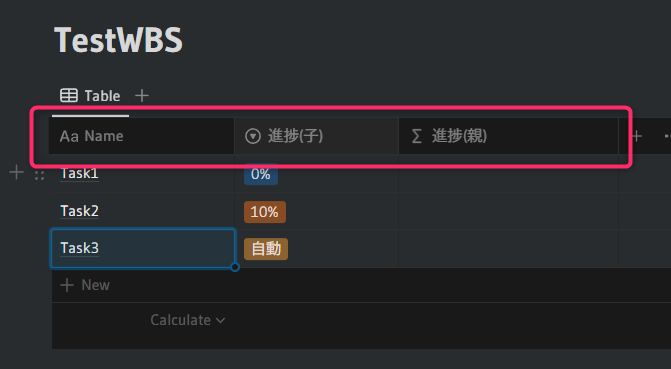


## サブアイテムの設定

データベースの設定(`･･･`ボタン)からサブアイテム(`Sub-items`)の設定を選択します．

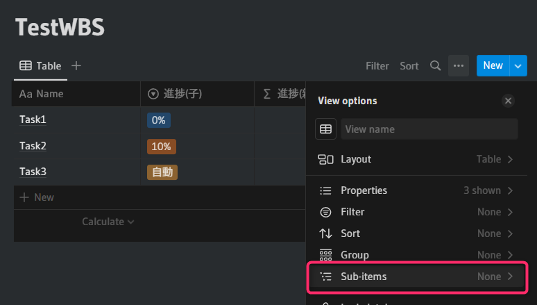

設定はデフォルトのままで問題ありません．

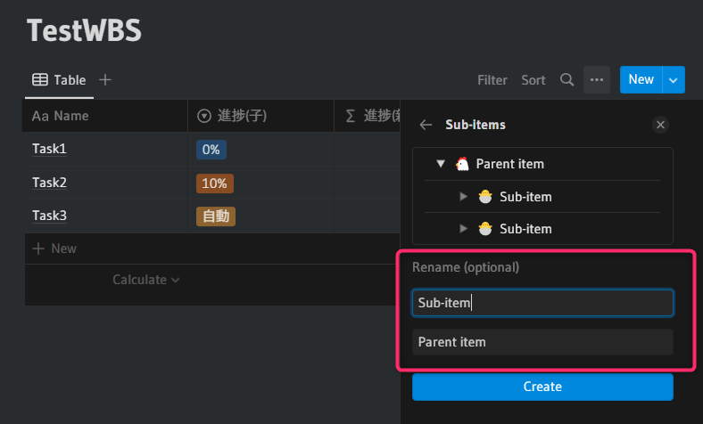

次のようなプロパティの構成になっているはずです．

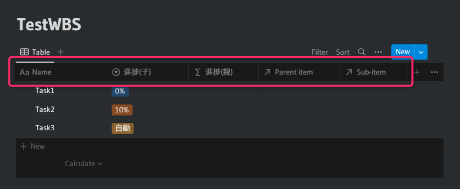


## 進捗率の計算

子の進捗率を計算して親の進捗率として表示します．そのためにプロパティを2つ作成します．
1つは「`_進捗N`」でFormulaタイプです．先頭の「`_`」は計算用を表しています．もう1つは「`_進捗R`」とします．こちらはロールアップで、リレーションに「`Sub-item`」を設定します．

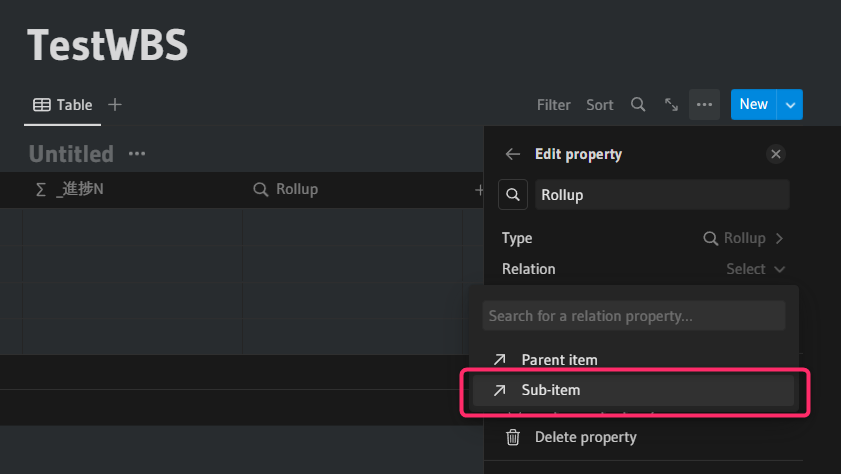

次にプロパティに「`_進捗N`」を設定します．

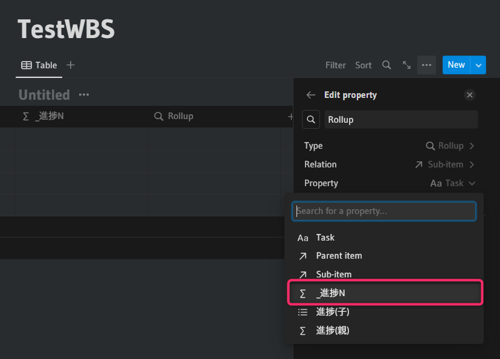

Calculateは「Show original」に設定しておきます．

この時点で、プロパティは次のようになっています．

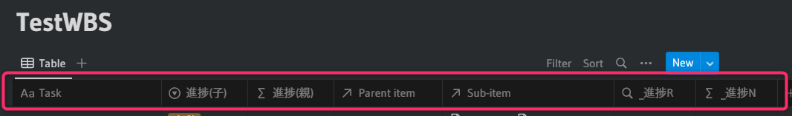

適当にタスクを追加して、タスクの親子関係を設定します．ここで重要なのは、子を持つ親タスクの進捗(子)は「`自動`」に設定しておいてください．

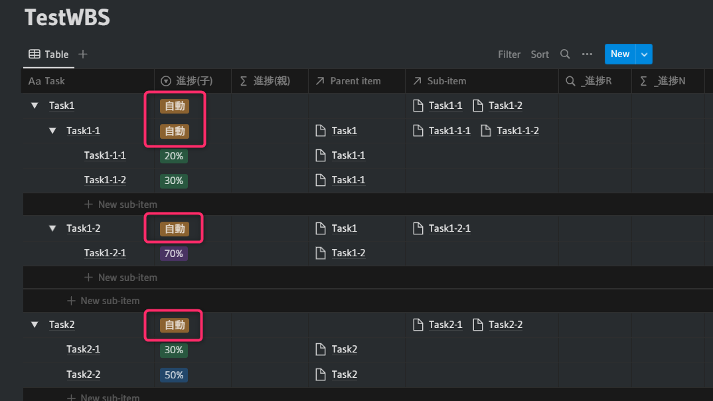

### 「`_進捗N`」の計算

「`_進捗N`」は子タスクの「`進捗(子)`」のセレクト値を数値に変換します．まず、「`_進捗N`」を数値として扱いたいので、Formulaで「1」と設定します．

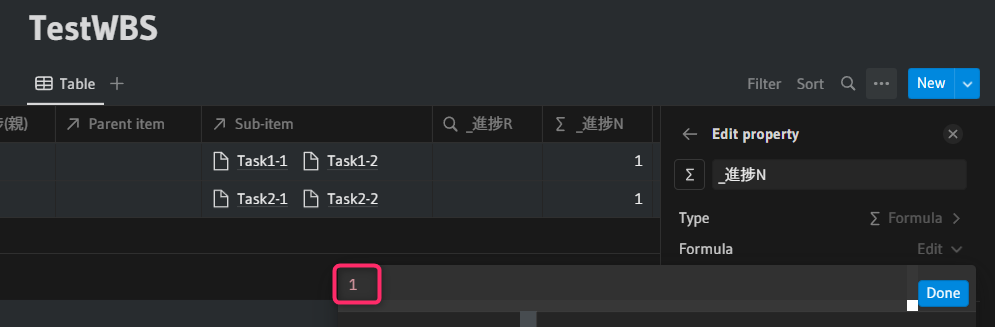

これで、このプロパティが数値として扱われます．数値として扱われると、数式プロパティのオプションに「Number format」と「Show as」が追加されます．

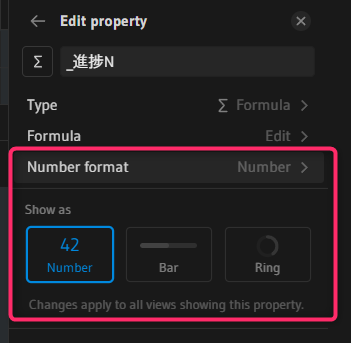

「Number format」を「Number」にし、「Show as」を「Ring」に設定します．

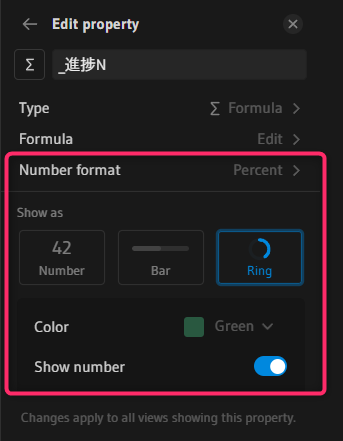

次に、「`_進捗N`」を数値に設定すると、そのプロパティをロールアップしている「`_進捗R`」の「Calculate」に項目が追加されますので、「Sum」を設定します．「Sum」にすれば「Show as」で表示形式を選べるようになりますが「Number」のままにしておきます．

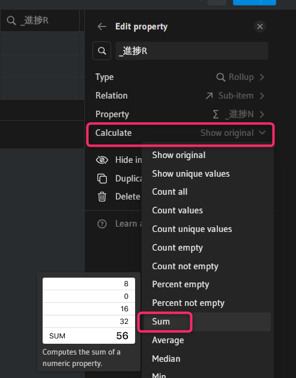

これで、「`_進捗N`」と「`_進捗R`」がともに数値となりました．次に「`_進捗N`」の数式を設定します．数式は次の通りです．

```js
if(prop("進捗(子)") == "自動", floor(prop("_進捗R") / max(1, length(replaceAll(prop("Sub-item") + ",", "[^,]", "")))), toNumber(slice(prop("進捗(子)"), 0, -1)))
```

何をやっているかを説明すると、そのタスクが親タスク(「進捗(子)」で`自動`を設定しているタスク)であれば、「`_進捗R`」（そのタスクの子タスクすべての進捗率の合計）から子タスクの数で割って進捗率を計算しています．また、子タスクであれば、「進捗(子)」のセレクト値を数値に変換しています．


### 「`進捗(親)`」の計算

あとは、「`進捗(親)`」の計算で進捗率を計算します．「`進捗(親)`」の数式に以下を設定します．

```js
if(length(prop("Sub-item")) > 0, floor(prop("_進捗R") / max(1, length(replaceAll(prop("Sub-item") + ",", "[^,]", "")))), prop("_進捗N")) / 100
```

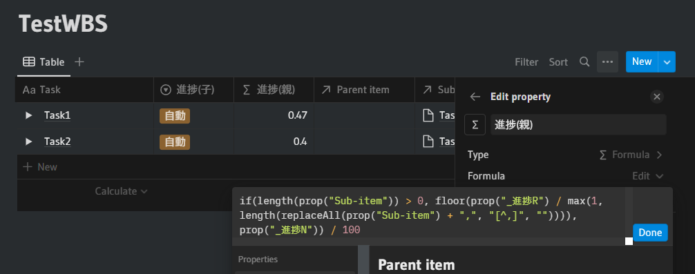

「Number format」は「Percent」、「Show as」は「Ring」に設定します．

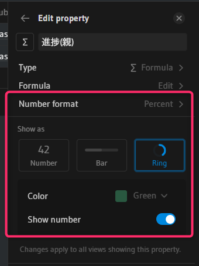

これで親タスクや子タスクを追加すると自動で計算されるようになります．

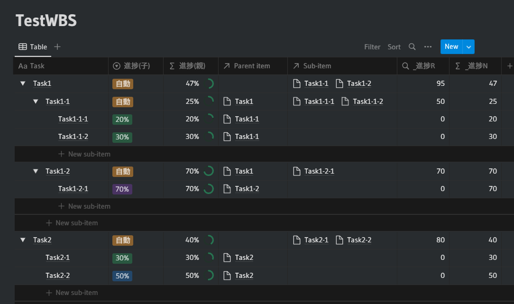

最後に不要なプロパティを非表示にすることで完成です．

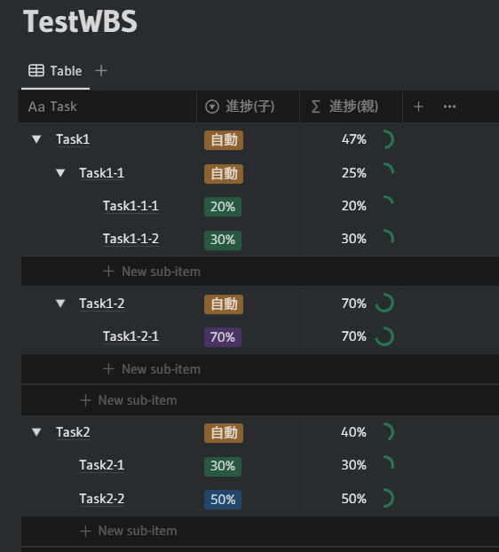


## ステータスプロパティを使った方法

これまでの方法では子タスクの進捗率を計算して親タスクの進捗率を算出しました．
もし、そこまで正確な値を求める必要はなく、全体のタスクの進捗が終わったかどうかだけ調べて進捗率に反映させたい場合、ステータスプロパティを使って数式を使わずとも計算できます．

まず、データベースを作成します．

- Task: Title
- 進捗(子): Status
- 進捗(親): Rollup

次に、サブアイテムの設定をします．設定はデフォルトのままで問題ありません．

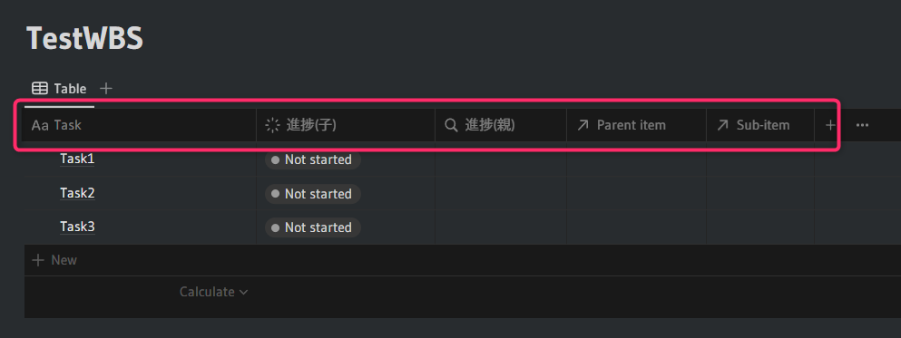

適当にタスクを追加して、タスクの親子関係を設定します．

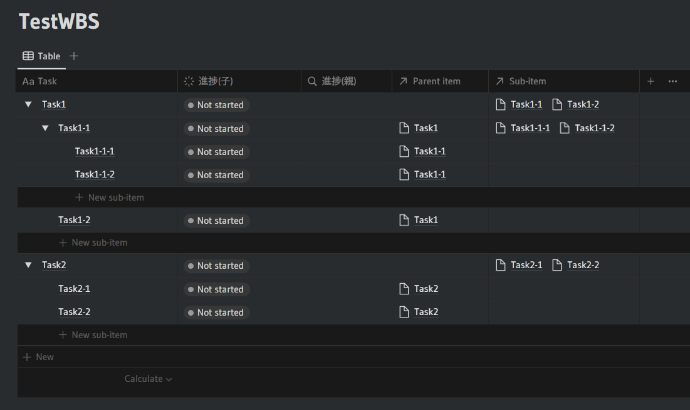

「進捗(親)」のロールアップで「Relation」を「Sub-item」、「Property」を「進捗(子)」、「Calculate」を「Percent per group -> Complete」に設定します．

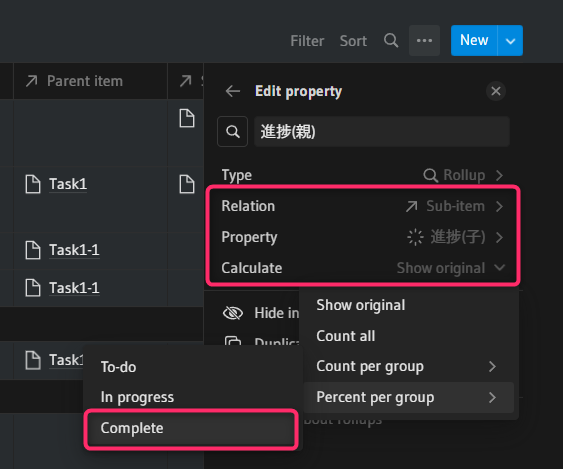

そうすると、「Show as」で表示形式を設定できるようになりますので、「Ring」を設定します．

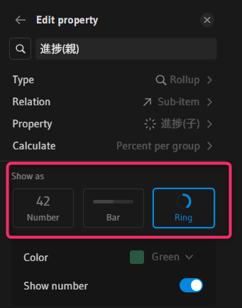

これで完成です．

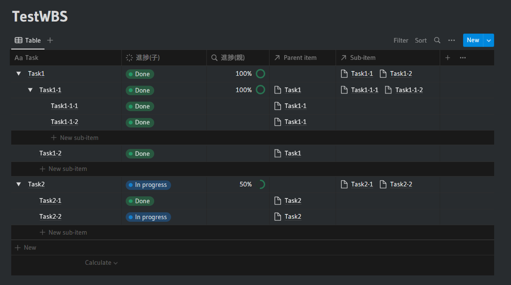

ただし、この方法では子タスクがすべて終わっても、その親タスクは自動で `Done` にならないので手動で行う必要があります．それを自動化することも可能かもしれませんが、ご自身で調べてみてください．


