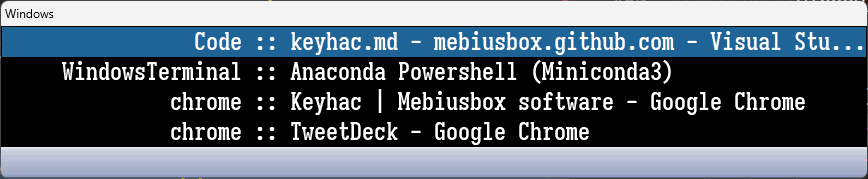
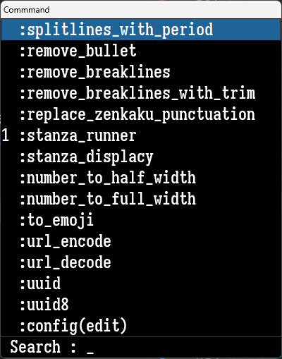
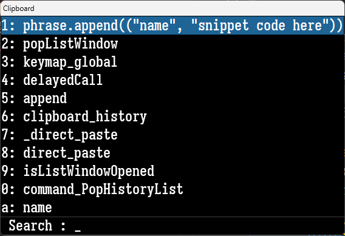

import Bookmark from '@site/src/components/Markdown/WebBookmark.tsx'

## Keyhac とは

Keyhac とは、Python を使ってキーカスタマイズが行えるアプリケーションです．

https://sites.google.com/site/craftware/keyhac-ja

<Bookmark name="craftware - Keyhac" url="https://sites.google.com/site/craftware/keyhac-ja" description="Keyhac - Pythonによる柔軟なキーカスタマイズツール" />

定型文入力をスニペットのように入力できるツールとして、 [aText](https://www.trankynam.com/atext/) を使っています．無料でも単純な定型文は入力することができますが、フル機能を使うためにはProバージョンにしなければならず、有料です．そんなに頻繁に利用するわけでもないですし、とりあえず他の方法でできないかと探していたところ、Keyhacにたどり着きました．

Keyhac のいいところは Python でカスタマイズできるところにあります．以前は [Charu3](http://keijiweb.com/software.html) を使っていました．マクロは用意されていたりプラグインもあるので、ある程度カスタマイズができるのですが、やはり限界があります．Python が使えるなら、テキスト処理以外のこともいろいろできるので汎用性は高いです．


## Keyhacの設定

Keyhacの設定方法を解説します．環境は Windows です．
まず、Keyhacを起動するとシステムトレイに常駐します．システムトレイからKeyhacアイコンを右クリックして、`設定の編集`を選択すると、設定ファイル(`config.py`)がエディタで開かれます．この設定ファイルを編集して、システムトレイから右クリック、`設定のリロード`で反映されます．

### コンソール画面

設定ファイルに問題があったり、実行したときにエラーが発生した場合はコンソール画面が表示されます．設定ファイルから `print` すると、このコンソール画面が表示されます．画面が表示されていない場合、システムトレイのKeyhacアイコンをダブルクリックすると表示されます．コンソール画面をクリアしたい場合、システムトレイからKeyhacアイコンを右クリックして`端末のクリア`を選択します．また、`内部ログをON`を選択すると、ログ情報がコンソール画面に出力されます．無効にしたいときは`内部ログをOFF`を選択します．


### configure関数

Keyhacを起動すると、設定ファイル(`config.py`)にある`configure`関数が呼ばれます．ここに処理を記述してきます．


### エディタの設定

設定ファイルの編集に使うエディタを設定します．Visual Studio Codeは開く場合は次のようにします．

```py
keymap.editor = "code"
```


### フォントの設定

コンソールなどのウィンドウに表示されるテキストのフォントを指定します．好きなフォントを指定してください．フォントを指定すると、起動に少し時間がかかるようになります．

```py
keymap.setFont("Iosevka", 16)
```

### テーマの設定

標準では `white` と `black` が用意されています．

```py
keymap.setTheme("black")
```


### キーの再登録

Keyhacではキーを別のキーに割り当てることができます．それには`keymap.replaceKey`メソッドを使います．私の場合、`無変換`キーと`変換キー`を適当な場所に再割り当てし、ユーザー修飾キーとしてそれらを登録します．ユーザー修飾キーの登録は `keymap.defineModifier`メソッドを使います．

```py
# Key replacement
keymap.replaceKey("(29)", 235)  # 無変換
keymap.replaceKey("(28)", 236)  # 変換

# User modifier key definition
keymap.defineModifier(235, "User0")
keymap.defineModifier(236, "User1")
```


### グローバルキーマップ

Keyhacではウィンドウごとにキーカスタマイズを行うことができますし、すべてのウィンドウに対してキーカスタマイズできます．後者の場合、`keymap.defineWindowKeymap`メソッドで取得したオブジェクトで設定します．

```py
# Global keymap which affects any windows
keymap_global = keymap.defineWindowKeymap()
```

例えば、`Shift`キーと`Z`キーを同時に押したときの処理を設定したい場合、次のようになります．

```py
keymap_global["S-Z"] = closure
```

キーに対応したクロージャを指定します．Keyhacはキーが押されたときに対応したクロージャを呼び出します．

指定できるキーやモディファイアについては[ドキュメント](https://crftwr.github.io/keyhac/mac/doc/ja/)を参照してください．


### 初期の設定

Keyhacでは標準でいくつか設定されています．まずは全部消すか、コメントアウトしておきましょう．


### Keyhacモジュール

`pyauto`と`keyhac`はKeyhacに用意されたモジュールです．`pyauto`は低レベルOS機能で、`keyhac`はそれ以外のものです．例えば、クリップボードを操作する場合、`keyhac` の `setClipboardText`, `getClipboardText` を使います．

```py
from keyhac import setClipboardText, getClipboardText
```

面倒なら、一括でインポートしても構いません．

```py
from keyhac import *
```

これらのモジュールについて、詳しくはドキュメントを参照してください．

Keyhacを使って emacs ライクなキー操作を実現している方がいます．設定ファイルも参考になると思います．

https://github.com/smzht/fakeymacs


## 実装した機能の紹介

それでは、次から具体的な設定をしていきます．といっても、あまり使いこなしている訳ではありませんので悪しからず．
ヘルパー関数は、それぞれ初出した場所に明記しています．


### カーソルをスクリーン中央に移動する

`Shift`キーと`右Ctrl`キーを押したときに実行します．

```py
def set_cursor_pos(x, y):
    keymap.beginInput()
    keymap.input_seq.append(pyauto.MouseMove(x, y))
    keymap.endInput()

def cursor_to_center():
    wnd = keymap.getTopLevelWindow()
    wnd_left, wnd_top, wnd_right, wnd_bottom = wnd.getRect()
    to_x = int((wnd_left + wnd_right) / 2)
    to_y = int((wnd_bottom + wnd_top) / 2)
    set_cursor_pos(to_x, to_y)

keymap_global["S-RCtrl"] = cursor_to_center
```


### ウィンドウをスクリーン中央に移動する

左右の`Ctrl`キーを押したときに実行します．

```py
def delay(sec=0.05):
    time.sleep(sec)

def get_monitor_areas():
    monitors = pyauto.Window.getMonitorInfo()
    main_monitor_first = sorted(monitors, key=lambda x: x[2], reverse=True)
    non_taskbar_areas = list(map(lambda x: x[1], main_monitor_first))
    return non_taskbar_areas
    
def set_window_rect(rect):
    wnd = keymap.getTopLevelWindow()
    if list(wnd.getRect()) == rect:
        wnd.maximize()
    else:
        if wnd.isMaximized():
            wnd.restore()
            delay()
        wnd.setRect(rect)

def window_to_center():
    wnd = keymap.getTopLevelWindow()
    if wnd.isMaximized():
        return None
    wnd_left, wnd_top, wnd_right, wnd_bottom = wnd.getRect()
    width = wnd_right - wnd_left
    height = wnd_bottom - wnd_top
    mntr_left, mntr_top, mntr_right, mntr_bottom = get_monitor_areas()[0]
    center_h = (mntr_right - mntr_left) / 2
    center_v = (mntr_bottom - mntr_top) / 2
    lx = int(center_h - width / 2)
    ly = int(center_v - height / 2)
    to_rect = (lx, ly, lx + width, ly + height)
    set_window_rect(to_rect)

keymap_global["C-RCtrl"] = window_to_center
```

もし、ウィンドウを最大化していた場合、先に通常のウィンドウに戻す必要があります．その場合、次のようにします．

```py
def window_to_center_force():
    wnd = keymap.getTopLevelWindow()
    if wnd.isMaximized():
        wnd.restore()
        delay()
    window_to_center()
```


### ウィンドウをカーソル位置に移動する

`無変換`キーと`右Ctrl`キーを押したときに実行します．

```py
def window_to_cursor():
    wnd = keymap.getTopLevelWindow()
    if wnd.isMaximized():
        return None
    wnd_left, wnd_top, wnd_right, wnd_bottom = wnd.getRect()
    width = wnd_right - wnd_left
    height = wnd_bottom - wnd_top
    x, y = pyauto.Input.getCursorPos()
    to_rect = (x, y, x + width, y + height)
    set_window_rect(to_rect)

keymap_global["U0-RCtrl"] = window_to_cursor
```


### ウィンドウを切り替える

`Alt+Tab`や`Win+Tab`のような機能です．Keyhacではリストを表示するウィンドウ機能がありますので、そちらを使います．今回は、`無変換`キーと`スペース`キーを押したときに実行します．

```py {47} showLineNumbers
# import re
# from keyhac import cblister_FixedPhrase
debug_mode = False # デバッグ出力を有効にする場合は True にする
def dbg(text):
    if debug_mode:
        print("dbg: " + text)

def truncate(string, length, ellipsis="..."):
    return string[:length] + (ellipsis if string[length:] else "")

def truncate_cjk(string, length, ellipsis="..."):
    # http://www.unicode.org/reports/tr11/
    count = 0
    text = ""
    for c in string:
        if unicodedata.east_asian_width(c) in "FWA":
            count += 2
        else:
            count += 1

        if count > length:
            text += ellipsis
            break
        text += c
    return text
    
def switch_windows():
    dbg(">>>>> switch_windows <<<<<")

    def popWindowList():
        # If the list window is already opened, just close it
        if keymap.isListWindowOpened():
            keymap.cancelListWindow()
            return

        def getWindowList(wnd, arg):
            if not wnd.isVisible():
                return True
            # if not wnd.getOwner():
            #     return True
            if wnd.getText() == "":
                return True
            dbg(wnd.getProcessName())
            dbg("  " + wnd.getClassName())
            dbg("    " + wnd.getText())
            if re.match(
                r"(keyhac|SystemSettings|ApplicationFrameHost|TextInputHost|explorer|onenoteim)\.exe",
                wnd.getProcessName(),
            ):
                dbg("(pass)")
                return True
            # if re.match(r"chrome", wnd.getClassName()):
            #     window_list.append(wnd)
            window_list.append(wnd)
            return True

        window_list = []
        Window.enum(getWindowList, None)

        popup_list = [
            ("{:>20s} :: {}".format(truncate(i.getProcessName()[:-4], 17), truncate_cjk(i.getText(), 45)), i)
            for i in sorted(window_list, key=lambda x: x.getProcessName())
        ]

        if mysetting.debug:
            for i in popup_list:
                dbg(i[0])

        listers = [("Windows", cblister_FixedPhrase(popup_list))]
        item, mod = keymap.popListWindow(listers)
        if item:
            item[1].setForeground()

    # Because the blocking procedure cannot be executed in the key-hook,
    # delayed-execute the procedure by delayedCall().
    keymap.delayedCall(popWindowList, 0)

keymap_global["U0-Space"] = switch_windows
```

実行結果は次のようになります．



正規表現(Line:47)を使って表示されるウィンドウを制限することもできます．

:::info
ちなみに、以前は[Tascher](http://frostmoon.sakura.ne.jp/Tascher/)というのを使っていたのですが、Keyhacに置き換えました．
:::

:::info
Keyhacのウィンドウ機能は、実は複数のリストを内部で持つことができます．以下のコードにあるように、`listers`に配列を設定しています．

```py
listers = [("Windows", cblister_FixedPhrase(popup_list))]
```

複数指定した場合、キーボードの左右キーで切り替えることができます．
:::


### ブラウザ(Chrome)を切り替える

Chromeウィンドウを次々に切り替える機能です．`無変換`キーと`F7`キーに割り当てています．

```py
# import time
# from keyhac import Window
chrome_history = []
def next_chrome_window():
    dbg(">>>>> next_chrome_window <<<<<")

    def getWindowList(wnd, arg):
        if not wnd.isVisible():
            return True
        # if not wnd.getOwner():
        #     return True
        if wnd.getText() == "":
            return True
        # dbg(wnd.getProcessName())
        if re.match(r"chrome", wnd.getProcessName()):
            window_list.append(wnd)
        # if re.match(r"chrome", wnd.getClassName()):
        #     window_list.append(wnd)
        # window_list.append(wnd)
        return True

    now = time.time_ns() / 1_000_000  # ms
    history = sorted(chrome_history, key=lambda x: x[1], reverse=True)
    if len(history) > 0:
        dbg("{}".format(now - history[0][1]))
        if now - history[0][1] > 5_000:  # 5s
            dbg("clear chrome history")
            chrome_history = []
            history = []

    if debug:
        for entry in history:
            dbg(f"{entry[0]}, {entry[1]}")

    next_window = (None, -1)
    window_list = []
    Window.enum(getWindowList, None)
    current_wnd_text = keymap.getTopLevelWindow().getText()
    dbg(f"[current] {current_wnd_text}")
    for wnd in window_list:
        text = wnd.getText()
        if current_wnd_text == text:
            continue
        idx = [i for i, e in enumerate(history) if e[0] == text]
        if len(idx) > 0:
            if next_window[1] < idx[0]:
                dbg(f"found in history: {text}({idx[0]})")
                next_window = (wnd, idx[0])
        else:
            dbg(f"not found in history: {text}")
            next_window = (wnd, len(history))
            break

    if next_window[0]:
        dbg("[next] " + next_window[0].getText())
        chrome_history.append((next_window[0].getText(), now))
        next_window[0].setForeground()
        
keymap_global["U0-F7"] = next_chrome_window
```


### アプリケーションを実行する

`keymap.ShellExecuteCommand`メソッドを使います．

```py
keymap.ShellExecuteCommand(verb, file, param, directory, swmode);
```

私は次のようなヘルパー関数を定義して使っています．

```py
def shell(s, arg=None):
    return keymap.ShellExecuteCommand(None, s, arg, None)

def shell_mini(s, arg=None):
    return keymap.ShellExecuteCommand(None, s, arg, None, "minimized")
```

例えば、Chromeで特定のURLを開きたい場合は次のようにします．

```py
keymap_global["U0-F9"] = shell(
    "C:\\Program Files\\Google\\Chrome\\Application\\Chrome.exe",
    "--new-window https://www.google.com/webhp?hl=ja",
)
```


### VSCodeの選択範囲拡大(x2)

Visual Studio Code で `Shift+Alt+右`キーは選択範囲の拡大になります．ちょうど2回実行すると、いい感じに選択できることが多いため重宝しています．しかし、`Shift+Alt+右`キーは押しづらいです．そこで、`無変換`キーと`右`キー押しで2回分の`Shift+Alt+右`キーを押すようにします．

```py
def ikey(*keys):
    return keymap.InputKeyCommand(*keys)

keymap_global["U0-Right"] = ikey("S-A-Right", "S-A-Right")
```


### マルチストロークキー

Keyhacではマルチストロークキーをサポートしています．`keymap.defineMultiStrokeKeymap`で最初のキーを登録します．例えば、`無変換`キーと`D`キーを押して、日付をフォーマットを指定して入力したい場合、次のようになります．

```py
def send_keys(*keys):
    keymap.beginInput()
    for key in keys:
        keymap.setInput_FromString(str(key))
    keymap.endInput()
    keymap._fixFunnyModifierState()
    
def set_ime(mode):
    if keymap.getWindow().getImeStatus() != mode:
        send_keys("(243)")
        delay(0.01)

def input_date(fmt):
    def _input_data():
        d = datetime.datetime.today()
        date_str = d.strftime(fmt)
        set_ime(0)
        send_input(date_str, 0)

    return _input_data

keymap_global["U0-D"] = keymap.defineMultiStrokeKeymap("DATE: [1]YMD, [2]Y/M/D, [3]Y-M-D")
for key, args in {
    "1": ["%Y%m%d"],
    "2": ["%Y/%m/%d"],
    "3": ["%Y-%m-%d"],
}.items():
    keymap_global["U0-D"][key] = input_date(*args)
```

実行すると、アクティブなウィンドウの下に `DATE: [1]YMD, [2]Y/M/D, [3]Y-M-D` が表示され、次のキー入力待ちになります．ここでは `1`、`2`、`3`キーのどれかを押すと、それぞれの書式に対応した日付が入力されます．

他に、括弧の入力支援は次のようになります．(`無変換`キーと`P`キー)

```py
def send_string(s):
    keymap.beginInput()
    keymap.setInput_Modifier(0)
    for c in s:
        keymap.input_seq.append(pyauto.Char(c))
    keymap.endInput()
    
def send_input(sequence, sleep=0.01):
    for elem in sequence:
        delay(sleep)
        try:
            send_keys(elem)
        except:
            send_string(elem)
            
def ime_input0(*sequence):
    def _ime_input0():
        set_ime(0)
        send_input(sequence)

    return _ime_input0

def ime_input1(*sequence):
    def _ime_input1():
        set_ime(1)
        send_input(sequence)

    return _ime_input1

keymap_global["U0-P"] = keymap.defineMultiStrokeKeymap("PARENTHES: [1]《》 [2]〈〉 [3]〔〕 [4]『』 [5]【】 [6]（） [7]()")
for key, args in {
    "1": ["《》", "Left"],
    "2": ["〈〉", "Left"],
    "3": ["〔〕", "Left"],
    "4": ["『』", "Left"],
    "5": ["【】", "Left"],
    "6": ["（）", "Left"],
    "7": ["()", "Left"],
}.items():
    keymap_global["U0-P"][key] = ime_input1(*args)
```


### 日本語入力時に半角の括弧を入れる

通常は全角の括弧(`（）`)ですが、半角を入れるようにできます．

```py
def ime_context(func):
    def _ime_context():
        mode = keymap.getWindow().getImeStatus()
        func()
        set_ime(mode)

    return _ime_context

keymap_global["U0-8"] = ime_context(ime_input0("S-8"))
keymap_global["U0-9"] = ime_context(ime_input0("S-9"))
```

`無変換`キーと`8`キーで`(`が、`無変換`キーと`9`キーで`)`が日本語入力時に入れられます．

同じやり方で、`／`を`/`、`「」`を`[]`と入力できます．

```py
keymap_global["U0-OpenBracket"] = ime_context(ime_input0("OpenBracket"))
keymap_global["U0-CloseBracket"] = ime_context(ime_input0("CloseBracket"))
keymap_global["U0-Slash"] = ime_context(ime_input0("Slash"))
```


### インクリメンタルサーチ

Keyhacはウィンドウを表示したときにインクリメンタルサーチを使えるのですが、検索モード(`f`キー)に入らないと使えないので不便です．そこで、ウィンドウを表示したときに自動で検索モードに入るようにしたいのですができません．また、ウィンドウはスクリーンの中央に表示してほしいのですが、標準ではスクリーンの原点(つまり左上)に表示されます．これがとても不満だったのですが、なんとか妥協できるレベルにできました．それは、ウィンドウを表示するキーを2回連続で押すことで、ウィンドウを中央に移動して、検索モードに入るようにすることです．次のようにします．

```py
 def lw_search():
    ikey("F")()
    lw_search_mode = True

def lw_exit():
    if lw_search_mode:
        ikey("Esc", "Esc")()
    else:
        ikey("Esc")()

def is_list_window(window):
    if window.getClassName() == "KeyhacWindowClass" and window.getText() != "Keyhac":
        lw_search_mode = False
        return True
    else:
        return False

keymap_lw = keymap.defineWindowKeymap(check_func=is_list_window)
keymap_lw["U0-N"] = ikey("Down")
keymap_lw["U0-P"] = ikey("Up")
keymap_lw["U0-AtMark"] = lambda: [window_to_center(), lw_search()]
keymap_lw["U0-Space"] = lambda: [window_to_center(), lw_search()]
keymap_lw["U0-Semicolon"] = lambda: [window_to_center(), lw_search()]
keymap_lw["Enter"] = ikey("Enter", "Enter")
keymap_lw["Escape"] = lw_exit
```

`keymap_lw`はKeyhacが表示するリストウィンドウに適用されるキーマップです．ウィンドウを表示するキーに `lambda: [window_to_center(), lw_search()]` を指定することで、ウィンドウを中央に表示し、検索モードに入るようになります．

検索モードでは、`Enter`キーを押すと、検索モードが終了するだけなので、2回`Enter`キーを押すようにしています．

また、`無変換`キーと`N`キーまたは`P`キーで上下にカーソルが移動するようにしています．他に`Escape`キーの処理をしていますが、これも検索モードから抜けるだけなので、2回押したことにしています


### コマンドパレット

`無変換`キーと`@`キーを押してコマンドパレットを表示します．各コマンドの実装は、このページの最後にあります．

```py
def command_PopCommandList():
    # If the list window is already opened, just close it
    if keymap.isListWindowOpened():
        keymap.cancelListWindow()
        return

    def popCommandList():
        commands = [
            ("  :splitlines_with_period", splitlines_with_period),
            ("  :remove_bullet", remove_bullet),
            ("  :remove_breaklines", remove_breaklines),
            ("  :remove_breaklines_with_trim", remove_breaklines_with_trim),
            ("  :replace_zenkaku_punctuation", replace_zenkaku_punctuation),
            ("1 :stanza_runner", stanza_runner),
            ("  :stanza_displacy", stanza_displacy),
            ("  :number_to_half_width", number_to_half_width),
            ("  :number_to_full_width", number_to_full_width),
            ("  :url_encode", url_encode),
            ("  :url_decode", url_decode),
            ("  :uuid", gen_uuid),
            ("  :uuid8", gen_uuid8),
            ("  :config(edit)", keymap.command_EditConfig),
            ("  :config(reload)", keymap.command_ReloadConfig),
            ("  :convert_google_drive_image_url", convert_google_drive_image_url),
            ("  ^since:today", itext("since:" + date_and_time("%Y-%m-%d", 0))),
            ("  ^since:yesterday", itext("since:" + date_and_time("%Y-%m-%d", -1))),
        ]

        listers = [("Commmand", cblister_FixedPhrase(commands))]

        item, mod = keymap.popListWindow(listers)

        if item:
            item[1]()

    # Because the blocking procedure cannot be executed in the key-hook,
    # delayed-execute the procedure by delayedCall().
    keymap.delayedCall(popCommandList, 0)

keymap_global["U0-AtMark"] = command_PopCommandList
```

実行すると次のようになります．



工夫しているところは `1 :stanza_runner` という部分があります．これは、ウィンドウを表示したら`1`キーを押すとそのコマンドが選択状態になります．ショートカットですね．

あと、コマンド名では `^xxx` で定型文を、`:xxx`はそれ以外に分類しています．

以下の2つのメソッドはそれぞれ、設定ファイルの編集、再読み込みをします．特に設定を編集して再読み込みは頻繁に利用します．

- keymap.command_EditConfig
- keymap.command_ReloadConfig


### クリップボード履歴

Keyhacではクリップボード履歴の機能が標準で実装されています．そのために`フック`を有効にする必要があります．確認するには、システムトレイからKeyhacアイコンを右クリックして確認できます．クリップボード履歴の設定は次のようになっています．

```py
# Enable clipboard monitoring hook (Default:Enabled)
keymap.clipboard_history.enableHook(True)

# Maximum number of clipboard history (Default:1000)
keymap.clipboard_history.maxnum = 10

# Total maximum size of clipboard history (Default:10MB)
keymap.clipboard_history.quota = 10 * 1024 * 1024
```

初期設定の状態だと、クリップボード履歴は `Ctrl+Shift+Z`キーに割り当てられています．

```py
# Open the clipboard history list
keymap_global["C-S-Z"] = keymap.command_ClipboardList
# Move the most recent history to tail
keymap_global["C-S-X"] = keymap.command_ClipboardRotate
# Remove the most recent history
keymap_global["C-S-A-X"] = keymap.command_ClipboardRemove
# Mark for quote pasting
keymap.quote_mark = "> "
```

ただ、標準の設定ではとても使いづらいと感じました．環境によるかもしれませんが、クリップボード履歴からの直接貼り付けが(`Shift+Enter`キー)が効かずに困りました．また、数字によるショートカットも使いたかったので、自前で実装します．幸いなことにクリップボード履歴自体は取得することが出来ますので、あとはコマンドパレットと同じやり方で実装します．ついでに、定型文機能も追加します．

```py
phrase = []
phrase.append(("name", "snippet code here"))

def paste_string(s):
    setClipboardText(s)
    send_keys("C-V")
    
def command_PopHistoryList():
    # If the list window is already opened, just close it
    if keymap.isListWindowOpened():
        keymap.cancelListWindow()
        return

    def popHistoryList():
        def direct_paste(s):
            def _direct_paste():
                paste_string(s)

            return _direct_paste

        histories = []
        items = keymap.clipboard_history.getListItems()
        for i, item in enumerate(items):
            histories.append(("{}: {}".format((i + 1) % 10, item[0]), direct_paste(item[1])))
        for i, item in enumerate(phrase):
            histories.append(("{}: {}".format(chr(ord("a") + i), item[0]), direct_paste(item[1])))

        listers = [("Clipboard", cblister_FixedPhrase(histories))]
        item, mod = keymap.popListWindow(listers)
        if item:
            item[1]()

    # Because the blocking procedure cannot be executed in the key-hook,
    # delayed-execute the procedure by delayedCall().
    keymap.delayedCall(popHistoryList, 0)

keymap_global["U0-Semicolon"] = command_PopHistoryList
```

私は`無変換`キーと`;`キーで実行するように設定しています．次のように表示されます．



`phrase`変数で定型文を追加できます．クリップボード履歴は数字で、定型文はアルファベットがショートカットになります．


## 設定ファイル

最後に私の設定ファイルから抜粋です．

```py title=config.py
import os
import datetime
import time
import re
import unicodedata
import urllib
import uuid
import pyauto
from keyhac import setClipboardText, getClipboardText, cblister_FixedPhrase, JobItem, JobQueue, Window

def configure(keymap):
    class MySetting:
        def __init__(self):
            self.chrome_history = []
            self.debug = False
            self.lw_search_mode = False
            self.phrase = []

    mysetting = MySetting()

    # Phrase
    # mysetting.phrase.append(("name", "snippet code here"))

    # User Define Functions

    def dbg(text):
        if mysetting.debug:
            print("dbg: " + text)

    def itext(text):
        return keymap.InputTextCommand(text)

    def ikey(*keys):
        return keymap.InputKeyCommand(*keys)

    def shell(s, arg=None):
        return keymap.ShellExecuteCommand(None, s, arg, None)

    def shell_mini(s, arg=None):
        return keymap.ShellExecuteCommand(None, s, arg, None, "minimized")

    def delay(sec=0.05):
        time.sleep(sec)

    def get_current_clipboard():
        s = getClipboardText() or ""
        return s

    def send_keys(*keys):
        keymap.beginInput()
        for key in keys:
            keymap.setInput_FromString(str(key))
        keymap.endInput()
        keymap._fixFunnyModifierState()

    def send_string(s):
        keymap.beginInput()
        keymap.setInput_Modifier(0)
        for c in s:
            keymap.input_seq.append(pyauto.Char(c))
        keymap.endInput()

    def send_input(sequence, sleep=0.01):
        for elem in sequence:
            delay(sleep)
            try:
                send_keys(elem)
            except:
                send_string(elem)

    def set_ime(mode):
        if keymap.getWindow().getImeStatus() != mode:
            send_keys("(243)")
            delay(0.01)

    def copy_string(sec=0.01):
        setClipboardText("")
        send_keys("C-Insert")
        delay(sec)
        return get_current_clipboard()

    def paste_string(s):
        setClipboardText(s)
        send_keys("C-V")

    def ime_input0(*sequence):
        def _ime_input0():
            set_ime(0)
            send_input(sequence)

        return _ime_input0

    def ime_input1(*sequence):
        def _ime_input1():
            set_ime(1)
            send_input(sequence)

        return _ime_input1

    def ime_context(func):
        def _ime_context():
            mode = keymap.getWindow().getImeStatus()
            func()
            set_ime(mode)

        return _ime_context

    def set_cursor_pos(x, y):
        keymap.beginInput()
        keymap.input_seq.append(pyauto.MouseMove(x, y))
        keymap.endInput()

    def cursor_to_center():
        wnd = keymap.getTopLevelWindow()
        wnd_left, wnd_top, wnd_right, wnd_bottom = wnd.getRect()
        to_x = int((wnd_left + wnd_right) / 2)
        to_y = int((wnd_bottom + wnd_top) / 2)
        set_cursor_pos(to_x, to_y)

    def get_monitor_areas():
        monitors = pyauto.Window.getMonitorInfo()
        main_monitor_first = sorted(monitors, key=lambda x: x[2], reverse=True)
        non_taskbar_areas = list(map(lambda x: x[1], main_monitor_first))
        return non_taskbar_areas

    def set_window_rect(rect):
        wnd = keymap.getTopLevelWindow()
        if list(wnd.getRect()) == rect:
            wnd.maximize()
        else:
            if wnd.isMaximized():
                wnd.restore()
                delay()
            wnd.setRect(rect)

    def window_to_center_force():
        wnd = keymap.getTopLevelWindow()
        if wnd.isMaximized():
            wnd.restore()
            delay()
        window_to_center()

    def window_to_center():
        wnd = keymap.getTopLevelWindow()
        if wnd.isMaximized():
            return None
        wnd_left, wnd_top, wnd_right, wnd_bottom = wnd.getRect()
        width = wnd_right - wnd_left
        height = wnd_bottom - wnd_top
        mntr_left, mntr_top, mntr_right, mntr_bottom = get_monitor_areas()[0]
        center_h = (mntr_right - mntr_left) / 2
        center_v = (mntr_bottom - mntr_top) / 2
        lx = int(center_h - width / 2)
        ly = int(center_v - height / 2)
        to_rect = (lx, ly, lx + width, ly + height)
        set_window_rect(to_rect)

    def window_to_cursor():
        wnd = keymap.getTopLevelWindow()
        if wnd.isMaximized():
            return None
        wnd_left, wnd_top, wnd_right, wnd_bottom = wnd.getRect()
        width = wnd_right - wnd_left
        height = wnd_bottom - wnd_top
        x, y = pyauto.Input.getCursorPos()
        to_rect = (x, y, x + width, y + height)
        set_window_rect(to_rect)

    def find_window(pattern):
        dbg(">>>>> find_window <<<<<")

        def getWindowList(wnd, arg):
            if not wnd.isVisible():
                return True
            # if not wnd.getOwner():
            #     return True
            if wnd.getText() == "":
                return True
            dbg(wnd.getProcessName())
            dbg("  " + wnd.getClassName())
            dbg("    " + wnd.getText())
            if re.match(
                r"{0}".format(pattern),
                wnd.getProcessName(),
            ):
                dbg("(found)")
                window_list.append(wnd)
                return False
            # if re.match(r"chrome", wnd.getClassName()):m
            #     windom_list.append(wnd)
            return True

        window_list = []
        Window.enum(getWindowList, pattern)

        if len(window_list) > 0:
            return window_list[0]

        dbg("(not found.)")
        return None

    def foreground_window(wnd):
        dbg(">>>>> foreground_window <<<<<")
        if wnd.isMinimized():
            wnd.restore()
            delay()
        wnd.setForeground()

    full_width_chars = (
        "ａｂｃｄｅｆｇｈｉｊｋｌｍｎｏｐｑｒｓｔｕｖｗｘｙｚＡＢＣＤＥＦＧＨＩＪＫＬＭＮＯＰＱＲＳＴＵＶＷＸＹＺ！”＃＄％＆’（）＊＋，−．／：；＜＝＞？＠［￥］＾＿‘｛｜｝～０１２３４５６７８９　"
    )
    half_width_chars = (
        "abcdefghijklmnopqrstuvwxyzABCDEFGHIJKLMNOPQRSTUVWXYZ!\"#$%&'()*+,-./:;<=>?@[\]^_`{|}～0123456789 "
    )

    # Convert to half-with characters
    def to_half_width_clipboard_text():
        s = getClipboardText()
        s = s.translate(str.maketrans(full_width_chars, half_width_chars))
        return s

    # Convert to full-with characters
    def to_full_width_clipboard_text():
        s = getClipboardText()
        s = s.translate(str.maketrans(half_width_chars, full_width_chars))
        return s

    # Convert to half-with characters
    def number_to_half_width():
        s = getClipboardText()
        s = s.translate(str.maketrans("０１２３４５６７８９", "0123456789"))
        paste_string(s)

    # Convert to full-with characters
    def number_to_full_width():
        s = getClipboardText()
        s = s.translate(str.maketrans("0123456789", "０１２３４５６７８９"))
        paste_string(s)

    # Convert to emoji numbers
    def to_emoji():
        # emoji = {
        #     ".0": "0️⃣",
        #     ".1": "1️⃣",
        #     ".2": "2️⃣",
        #     ".3": "3️⃣",
        #     ".4": "4️⃣",
        #     ".5": "5️⃣",
        #     ".6": "6️⃣",
        #     ".7": "7️⃣",
        #     ".8": "8️⃣",
        #     ".9": "9️⃣",
        #     ".#": "#️⃣",
        #     ".*": "*️⃣",
        #     ".!": "✅",
        #     ".a": "📌",
        #     ".b": "📖",
        #     ".c": "📁",
        #     ".d": "💡",
        #     ".e": "🔸",
        #     ".f": "🔹",
        #     ".g": "⚠️",
        #     ".h": "⚡️",
        #     ".i": "⭐️",
        #     ".j": "🔥",
        # }
        # # emoji = {k: v.strip("\ufe0f") for k, v in emoji.items()}
        # s = getClipboardText()
        # # s = s.translate(str.maketrans(emoji))
        # pairs = re.split("(..)", s)[1::2]
        # s = "".join(emoji.get(pair, "") for pair in pairs)
        # paste_string(s)
        #
        # 上記のコードでは上手くいかないのでPowerShellで実行.
        # (setClipboardTextするとおかしくなる)
        shell_mini("pwsh.exe", '-nop -f "C:\\Users\\{user}\\convert_to_emoji.ps1"')()

    def url_encode():
        paste_string(urllib.parse.quote(getClipboardText(), safe=""))

    def url_decode():
        paste_string(urllib.parse.unquote(getClipboardText()))

    def next_chrome_window():
        dbg(">>>>> next_chrome_window <<<<<")

        def getWindowList(wnd, arg):
            if not wnd.isVisible():
                return True
            # if not wnd.getOwner():
            #     return True
            if wnd.getText() == "":
                return True
            # dbg(wnd.getProcessName())
            if re.match(r"chrome", wnd.getProcessName()):
                window_list.append(wnd)
            # if re.match(r"chrome", wnd.getClassName()):
            #     window_list.append(wnd)
            # window_list.append(wnd)
            return True

        now = time.time_ns() / 1_000_000  # ms
        history = sorted(mysetting.chrome_history, key=lambda x: x[1], reverse=True)
        if len(history) > 0:
            dbg("{}".format(now - history[0][1]))
            if now - history[0][1] > 5_000:  # 5s
                dbg("clear chrome history")
                mysetting.chrome_history = []
                history = []

        if mysetting.debug:
            for entry in history:
                dbg(f"{entry[0]}, {entry[1]}")

        next_window = (None, -1)
        window_list = []
        Window.enum(getWindowList, None)
        current_wnd_text = keymap.getTopLevelWindow().getText()
        dbg(f"[current] {current_wnd_text}")
        for wnd in window_list:
            text = wnd.getText()
            if current_wnd_text == text:
                continue
            idx = [i for i, e in enumerate(history) if e[0] == text]
            if len(idx) > 0:
                if next_window[1] < idx[0]:
                    dbg(f"found in history: {text}({idx[0]})")
                    next_window = (wnd, idx[0])
            else:
                dbg(f"not found in history: {text}")
                next_window = (wnd, len(history))
                break

        if next_window[0]:
            dbg("[next] " + next_window[0].getText())
            mysetting.chrome_history.append((next_window[0].getText(), now))
            next_window[0].setForeground()

    def truncate(string, length, ellipsis="..."):
        return string[:length] + (ellipsis if string[length:] else "")

    def truncate_cjk(string, length, ellipsis="..."):
        # http://www.unicode.org/reports/tr11/
        count = 0
        text = ""
        for c in string:
            if unicodedata.east_asian_width(c) in "FWA":
                count += 2
            else:
                count += 1

            if count > length:
                text += ellipsis
                break
            text += c
        return text

    def switch_windows():
        dbg(">>>>> switch_windows <<<<<")

        def popWindowList():
            # If the list window is already opened, just close it
            if keymap.isListWindowOpened():
                keymap.cancelListWindow()
                return

            def getWindowList(wnd, arg):
                if not wnd.isVisible():
                    return True
                # if not wnd.getOwner():
                #     return True
                if wnd.getText() == "":
                    return True
                dbg(wnd.getProcessName())
                dbg("  " + wnd.getClassName())
                dbg("    " + wnd.getText())
                if re.match(
                    r"(keyhac|DesktopTicker|SystemSettings|ApplicationFrameHost|TextInputHost|explorer|onenoteim)\.exe",
                    wnd.getProcessName(),
                ):
                    dbg("(pass)")
                    return True
                # if re.match(r"chrome", wnd.getClassName()):
                #     window_list.append(wnd)
                window_list.append(wnd)
                return True

            window_list = []
            Window.enum(getWindowList, None)

            popup_list = [
                ("{:>20s} :: {}".format(truncate(i.getProcessName()[:-4], 17), truncate_cjk(i.getText(), 45)), i)
                for i in sorted(window_list, key=lambda x: x.getProcessName())
            ]

            if mysetting.debug:
                for i in popup_list:
                    dbg(i[0])

            listers = [("Windows", cblister_FixedPhrase(popup_list))]
            item, mod = keymap.popListWindow(listers)
            if item:
                item[1].setForeground()

        # Because the blocking procedure cannot be executed in the key-hook,
        # delayed-execute the procedure by delayedCall().
        keymap.delayedCall(popWindowList, 0)


    # Setting with program file path (Simple usage)
    keymap.editor = "code"

    # Font
    keymap.setFont("Sarasa Fixed Slab J Semibold", 24)

    # Theme
    keymap.setTheme("black")

    # Simple key replacement
    keymap.replaceKey("(29)", 235)  # 無変換
    keymap.replaceKey("(28)", 236)  # 変換

    # User modifier key definition
    keymap.defineModifier(235, "User0")
    keymap.defineModifier(236, "User1")

    # Global keymap which affects any windows
    keymap_global = keymap.defineWindowKeymap()
    keymap.quote_mark = "> "  # Mark for quote pasting

    keymap_global["S-RCtrl"] = cursor_to_center
    keymap_global["C-RCtrl"] = window_to_center
    keymap_global["U0-RCtrl"] = window_to_cursor
    keymap_global["U0-Space"] = switch_windows
    keymap_global["U0-F7"] = next_chrome_window
    keymap_global["U0-F8"] = window_to_center_force
    keymap_global["U0-F9"] = shell(
        "C:\\Program Files\\Google\\Chrome\\Application\\Chrome.exe",
        "--new-window https://www.google.com/webhp?hl=ja",
    )
    keymap_global["U0-Right"] = ikey("S-A-Right", "S-A-Right")

    def switch_zulip():
        wnd = find_window("^Zulip")
        if wnd:
            foreground_window(wnd)
        else:
            dbg("(start zulip.)")
            shell("C:\\Users\\{user}\\AppData\\Local\\Programs\\zulip\\Zulip.exe")()

    keymap_global["U0-M"] = switch_zulip
    keymap_global["U0-P"] = keymap.defineMultiStrokeKeymap("PARENTHES: [1]《》 [2]〈〉 [3]〔〕 [4]『』 [5]【】 [6]（） [7]()")
    for key, args in {
        "1": ["《》", "Left"],
        "2": ["〈〉", "Left"],
        "3": ["〔〕", "Left"],
        "4": ["『』", "Left"],
        "5": ["【】", "Left"],
        "6": ["（）", "Left"],
        "7": ["()", "Left"],
    }.items():
        keymap_global["U0-P"][key] = ime_input1(*args)

    def input_date(fmt):
        def _input_data():
            d = datetime.datetime.today()
            date_str = d.strftime(fmt)
            set_ime(0)
            send_input(date_str, 0)

        return _input_data

    keymap_global["U0-D"] = keymap.defineMultiStrokeKeymap("DATE: [1]YMD, [2]Y/M/D, [3]Y-M-D")
    for key, args in {
        "1": ["%Y%m%d"],
        "2": ["%Y/%m/%d"],
        "3": ["%Y-%m-%d"],
    }.items():
        keymap_global["U0-D"][key] = input_date(*args)

    keymap_global["U0-8"] = ime_context(ime_input0("S-8"))
    keymap_global["U0-9"] = ime_context(ime_input0("S-9"))
    keymap_global["U0-OpenBracket"] = ime_context(ime_input0("OpenBracket"))
    keymap_global["U0-CloseBracket"] = ime_context(ime_input0("CloseBracket"))
    keymap_global["U0-Slash"] = ime_context(ime_input0("Slash"))

    def splitlines_with_period():
        s = get_current_clipboard()
        s = s.replace("\r\n", "").split(".")
        s = ".\r\n".join(list(map(str.strip, s)))
        paste_string(s)

    def remove_bullet():
        paste_string(get_current_clipboard().replace(" ∙ ", " ").replace("∙", ""))

    def remove_breaklines():
        paste_string(get_current_clipboard().replace("\r\n", ""))

    def remove_breaklines_with_trim():
        paste_string("".join(list(map(str.strip, get_current_clipboard().split("\r\n")))))

    def replace_zenkaku_punctuation():
        paste_string(get_current_clipboard().replace("．", "。"))

    def stanza_runner():
        paste_string('p ./stanza_runner.py "{}"'.format(get_current_clipboard().replace('"', '""')))

    def stanza_displacy():
        paste_string('p ./stanza_displacy.py "{}"'.format(get_current_clipboard().replace('"', '""')))

    def convert_google_drive_image_url():
        # https://drive.google.com/open?id=XXXX&authuser=xxx.gmail.com&usp=drive_fs
        # -> https://drive.google.com/file/d/XXXX/view
        s = getClipboardText()
        result = re.match("https://.+open\?id=(\w+)", s)
        if result:
            paste_string("https://drive.google.com/file/d/{0}/view".format(result.group(1)))

    # Return formatted date-time string
    def date_and_time(fmt, d):
        return (datetime.datetime.now() + datetime.timedelta(d)).strftime(fmt)

    def gen_uuid():
        s = getClipboardText()
        uid = str(uuid.uuid5(uuid.uuid1(), s))
        paste_string(uid.replace("-", ""))

    def gen_uuid8():
        s = getClipboardText()
        uid = str(uuid.uuid5(uuid.uuid1(), s))
        paste_string(uid[0:8])

    def command_PopCommandList():
        # If the list window is already opened, just close it
        if keymap.isListWindowOpened():
            keymap.cancelListWindow()
            return

        def popCommandList():
            commands = [
                ("  :splitlines_with_period", splitlines_with_period),
                ("  :remove_bullet", remove_bullet),
                ("  :remove_breaklines", remove_breaklines),
                ("  :remove_breaklines_with_trim", remove_breaklines_with_trim),
                ("  :replace_zenkaku_punctuation", replace_zenkaku_punctuation),
                ("1 :stanza_runner", stanza_runner),
                ("  :stanza_displacy", stanza_displacy),
                ("  :number_to_half_width", number_to_half_width),
                ("  :number_to_full_width", number_to_full_width),
                ("  :to_emoji", to_emoji),
                ("  :url_encode", url_encode),
                ("  :url_decode", url_decode),
                ("  :uuid", gen_uuid),
                ("  :uuid8", gen_uuid8),
                ("  :config(edit)", keymap.command_EditConfig),
                ("  :config(reload)", keymap.command_ReloadConfig),
                ("  :convert_google_drive_image_url", convert_google_drive_image_url),
                ("  ^since:today", itext("since:" + date_and_time("%Y-%m-%d", 0))),
                ("  ^since:yesterday", itext("since:" + date_and_time("%Y-%m-%d", -1))),
            ]

            listers = [("Commmand", cblister_FixedPhrase(commands))]

            item, mod = keymap.popListWindow(listers)

            if item:
                item[1]()

        # Because the blocking procedure cannot be executed in the key-hook,
        # delayed-execute the procedure by delayedCall().
        keymap.delayedCall(popCommandList, 0)

    keymap_global["U0-AtMark"] = command_PopCommandList

    def command_PopHistoryList():
        # If the list window is already opened, just close it
        if keymap.isListWindowOpened():
            keymap.cancelListWindow()
            return

        def popHistoryList():
            def direct_paste(s):
                def _direct_paste():
                    paste_string(s)

                return _direct_paste

            histories = []
            items = keymap.clipboard_history.getListItems()
            for i, item in enumerate(items):
                histories.append(("{}: {}".format((i + 1) % 10, item[0]), direct_paste(item[1])))
            for i, item in enumerate(mysetting.phrase):
                histories.append(("{}: {}".format(chr(ord("a") + i), item[0]), direct_paste(item[1])))

            listers = [("Clipboard", cblister_FixedPhrase(histories))]
            item, mod = keymap.popListWindow(listers)
            if item:
                item[1]()

        # Because the blocking procedure cannot be executed in the key-hook,
        # delayed-execute the procedure by delayedCall().
        keymap.delayedCall(popHistoryList, 0)

    keymap_global["U0-Semicolon"] = command_PopHistoryList

    def lw_search():
        ikey("F")()
        mysetting.lw_search_mode = True

    def lw_exit():
        if mysetting.lw_search_mode:
            ikey("Esc", "Esc")()
        else:
            ikey("Esc")()

    def is_list_window(window):
        if window.getClassName() == "KeyhacWindowClass" and window.getText() != "Keyhac":
            mysetting.lw_search_mode = False
            return True
        else:
            return False

    keymap_lw = keymap.defineWindowKeymap(check_func=is_list_window)
    keymap_lw["U0-N"] = ikey("Down")
    keymap_lw["U0-P"] = ikey("Up")
    keymap_lw["U0-AtMark"] = lambda: [window_to_center(), lw_search()]
    keymap_lw["U0-Space"] = lambda: [window_to_center(), lw_search()]
    keymap_lw["U0-Semicolon"] = lambda: [window_to_center(), lw_search()]
    keymap_lw["Enter"] = ikey("Enter", "Enter")
    keymap_lw["Escape"] = lw_exit

    # Customizing clipboard history list

    # Enable clipboard monitoring hook (Default:Enabled)
    keymap.clipboard_history.enableHook(True)

    # Maximum number of clipboard history (Default:1000)
    keymap.clipboard_history.maxnum = 10

    # Total maximum size of clipboard history (Default:10MB)
    keymap.clipboard_history.quota = 10 * 1024 * 1024
```

`{user}`は、Windowsのユーザー名に置き換えてください．また、絵文字を変換するPowerShellスクリプトは次のようになっています．

```powershell title=convert_to_emoji.ps1
$emoji = @{
    "0"= "0️⃣"
    "1"= "1️⃣"
    "2"= "2️⃣"
    "3"= "3️⃣"
    "4"= "4️⃣"
    "5"= "5️⃣"
    "6"= "6️⃣"
    "7"= "7️⃣"
    "8"= "8️⃣"
    "9"= "9️⃣"
    "#"= "#️⃣"
    "*"= "*️⃣"
    "!"= "✅"
    "a"= "📌"
    "b"= "📖"
    "c"= "📁"
    "d"= "💡"
    "e"= "🔸"
    "f"= "🔹"
    "g"= "⚠️"
    "h"= "⚡️"
    "i"= "⭐️"
    "j"= "🔥"
}
$chars = Get-Clipboard
$result = ""
foreach ($_ in $chars.ToCharArray()) {
    if ($emoji.ContainsKey("${_}")) {
        $result += $emoji["${_}"];
    } else {
        $result += $_;
    }
}
Set-Clipboard $result
```

以上です．Keyhacはとても便利なので、興味があれば使ってみてください．