import Bookmark from '@site/src/components/Markdown/WebBookmark.tsx'
import Tweet from '@site/src/components/Markdown/TweetBlock.tsx'


## Notionとは

簡単にいうと高性能なWikiに強力なデータベース機能が組み込まれたものです．基本はページを作成して，そのサブページを作っていく感じです．ただ，Notionはかなり直感的にコンテンツを作れます．テキストだけではなく，表や画像などかなり扱いやすいです．例えば，2段や3段といった段組が簡単に行えるし，Markdown 方式でもサクサク書けるのはとてもいい感じです．また，外部サービスとの連携も充実してきていて，さまざまなコンテンツをページに埋め込むことができます．

単純なプロジェクトのドキュメントなどでは Wiki のような運用で問題ないと思いますが，さまざまなコンテンツを含むナレッジベースのようなものを構築する場合には，Wiki ベースの管理方法は上手くいかないことはすでに分かっているので，Wikiのように使っていてはダメだと考えます．あくまで，個人的な意見です．それではどうするかということをこれから書いていきますが，その前にNotionについてもう少し知っておきましょう．

:::info
英語版と日本語版のスクリーンショットが混在してしまっているのでご了承ください
:::


### ページとブロック

Notion はすべてページであり、ページはブロックで構成されています．テキストや見出し、数式やコード、埋め込みなどすべてがブロックになっています．Notionではブロック単位で編集したり、ブロックの中を編集することになります．


### 2種類のページ

Notionでは、まずページを作成します．ページの作成は **新規ページ** ボタンを押します．

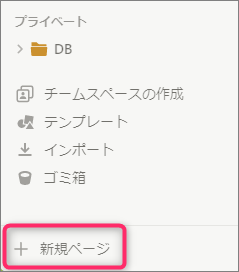


Notionには2種類のページがあります．**通常ページ**と**データベースページ**です．新規ページを作成すると次の画面になります．

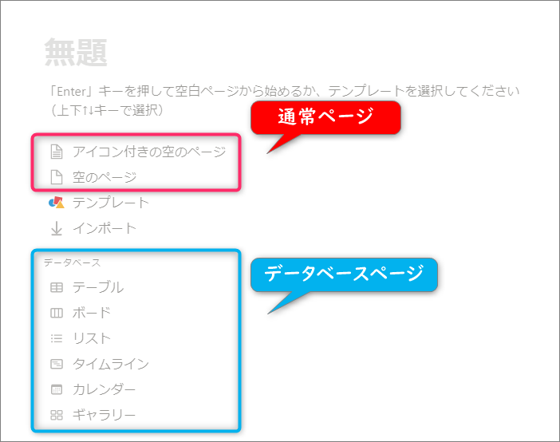

空のページ(アイコン付き)や、テンプレートからページを作成、データベースページを作成するショートカットが並んでいます．

データベースページはテーブル，ボード、タスク，リスト，カレンダー，ギャラリーがあり，データベースにページの追加や削除をします．これが良くできていて，テーブルやタスク，リストなどすべてが相互に切り替えることができます．ビューを切り替える感じですね．実際，データベースにビューをいくつも設定できて，各ビューがテーブルだったり，タスクだったりするわけです．


### ブロック

Notion の特徴にこのブロックがあります．簡単にいうと1文が1ブロックです．ブロックはテキスト，数式，画像，水平線，見出しといったさまざまな要素です．Notionではストレージの単位がブロック単位です．このブロックの入力が洗練されていて，通常はMarkdownで書きますが，スラッシュ（`/`）コマンドで選べたり，ショートカットを使ったりと，慣れるとかなり速く入力できます．


### インライン

ページはブロックで構成されていますが、一部のブロックは別のブロックの中に含めることができます．このようにブロックの中に別のブロックを入れることを**インライン**といいます．


### インライン形式のページ

もちろん、ページの中にページを入れることができます．このようなページを**サブページ**といいます．サブページの作成は `/page` コマンドを使います．

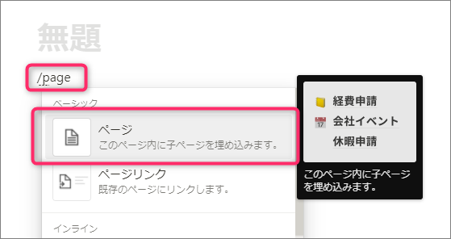

また、`+` コマンド(または `[[` コマンド)を使って作成できます．この場合、コマンドの後ろにページ名を入力します．

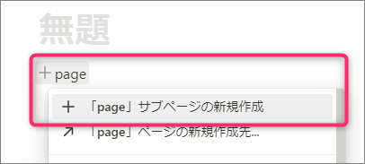

サブページを作る方法はこの2種類ですが、実はそれぞれ少し違います．それは `/page` コマンドがブロック形式のページ、 `+` コマンドがインライン形式のページとなります．

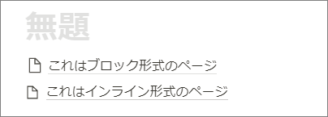

見た目が若干違うことがわかりますか？<br />
実際に作ってみると違いがわかります．以前はブロック形式のページしか作れませんでしたが、新たにインライン形式のページが追加されました．インライン形式のページであれば、ブロックの中にサブページを含めることができます．これにより、ページの説明などをその後ろに書くことができます．これはブロック形式のページではできません．

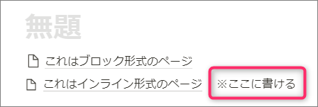

どちらもサブページであることには変わりません．インライン形式のページからブロック形式のページへの変換は可能ですが、ブロック形式のページからインライン形式のページへは（私が調べた限りでは）変換できません．その場合、インライン形式のページを作って、ブロック形式のページの中身をコピーや移動するしかありません．どちらの形式のページがいいかについては、特に決まりはないと思いますが、通常はインライン形式のページで問題ありません．


### データベース

データベースはNotionの主要な機能の1つです．データベースはページの集まりです．データベースのページは**プロパティ**を持つことができます．さまざまプロパティが用意されており、ページに情報を追加することができ、プロパティによってフィルターやソートができます．また、データベース間の参照（**ロールアップ**）が可能で、あるデータベースから別のデータベースを参照して一緒に表示したり、別のデータベースのページと関連づけできます．さらに、**サブアイテム**機能を追加することで、単一のデータベースでページ間の親子関係を構築することも可能になりました．

データベースはページの集まりですが、それを表示するための機能として**ビュー**があります．新規ページでデータベース作成のショートカットは、このビューが並んでいることになります．ビューはデータベース固有のものと、**リンクドビュー**があります．リンクドビューは任意のデータベースを選んで、それに対してビューを作成できます．また、1つのリンクドビューにさまざまなデータベースのビューを作成できます．

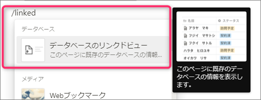

データベースにもインライン形式のデータベースがあります．通常、データベースはページなので、サブページとして作られます．しかし、インライン形式のデータベースの場合、リンクドビューが作成され、その中にデータベースが作成されます．

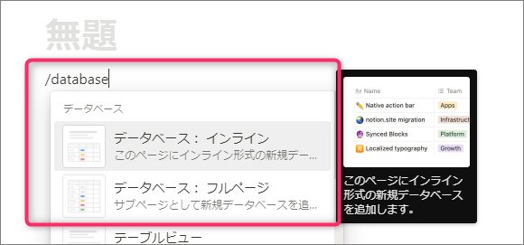

:::info
インライン形式のデータベースの場合、リンクドビューが作成され、データベースはそのリンクドビューのサブページとして作成されます．それに対して、インライン形式ではない（フルページ）データベースは、そのページのサブページとして作成されます．
:::

データベースページを開くと、データベース固有のビューで表示されます．リンクドビューを作成するときに、ソースとしてデータベースを選択し、ビューを作成するときにデータベース固有のビューからコピーすることもできます．


### テンプレート

Notionでは公式やコミュニティによって、ページの**テンプレート**が公開されています．テンプレートからページを新規に作成できます．そうすることで、ページ作成の手間を省くことができます．テンプレートは新規ページやサイドバーからテンプレートを選択して使用できます．また、他の人が公開されているページでは「複製」をすることでテンプレートとして使用することができます（複製は許可されているページでないと使うことができません）


## ワークフロー

それでは一通り説明が終わったので，私なりのやり方を説明してみます．キーとなるのはデータベースページです．これを使って構築していきます．まずは空の通常ページを作成して，`DB` という名前をつけます．

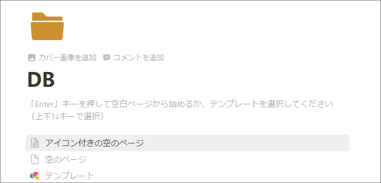


その下に文書（メモ）用のドキュメントデータベースを作成します．サイドバーのDBページの右にある `+` アイコンをクリックすると，DBにページを作成できます．

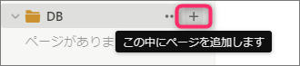

ページを作成して名前を `Documents` とし，DATABASEの `テーブル` ページを作成します．

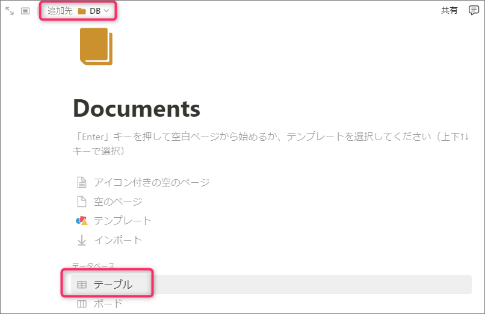

テーブルページを作成すると最初にビューの設定画面になります．まずはデータソースとなるデータベースを選択します．既存のデータベースを選ぶこともできますが，ここでは新規にデータベースを作成します．下の方にある `新規データベース` を選択します．

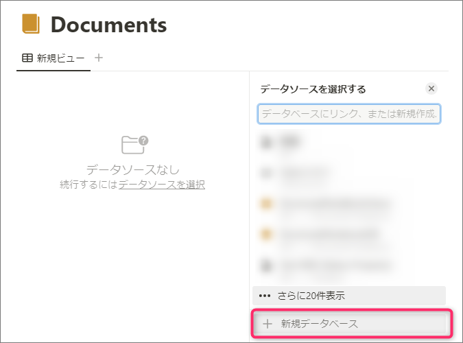

すると次のようにテーブルビューができます．

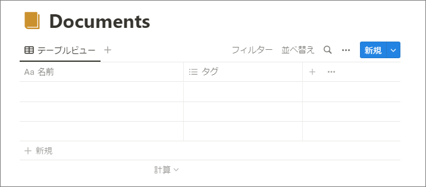

ドキュメントデータベース用にプロパティを作成します．カラム横にある `+` を選択して新規のプロパティを作成します．

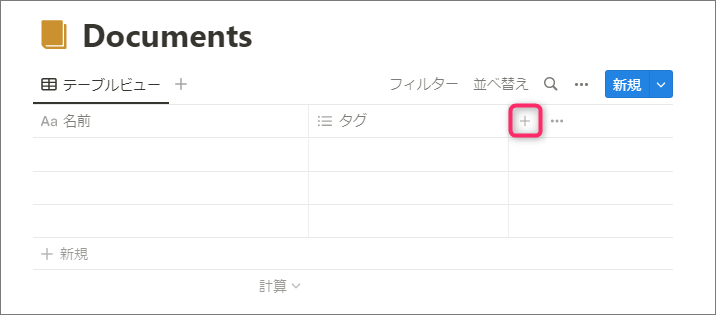

まずは `フォルダ` を作成します． `種類` は `マルチセレクト` にします．

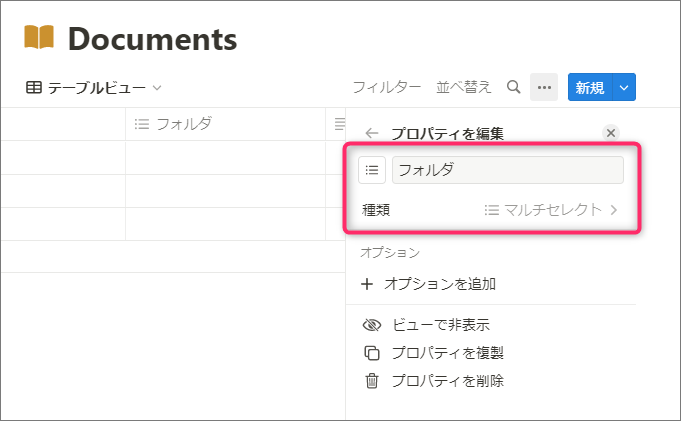

:::info
`フォルダ`と`タグ`の使い訳ですが、フォルダは必ず1つ以上設定しなければいけないもので、タグは任意です．また、フォルダは複数設定しても構いません．もし、フォルダが不要であれば、フォルダとタグは1つにまとめても構いません．
:::

他にも以下のプロパティを作成します．

| Name | Type |
| ---- | ---- |
| キーワード | テキスト |
| リンク | URL |
| 説明 | テキスト |
| ファイル | ファイル＆メディア |
| 作成日時 | 作成日時 |
| 最終更新日時 | 最終更新日時 |

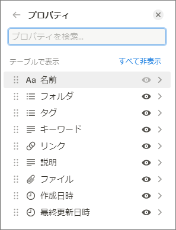

プロパティが多いのでページに表示されるプロパティの設定をします．まずは Documents データベースにある適当なページを開きます．

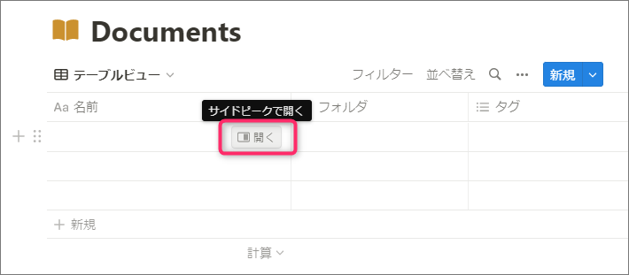

ページを開いたら右上にある `…` から `ページをカスタマイズ` を選択します．

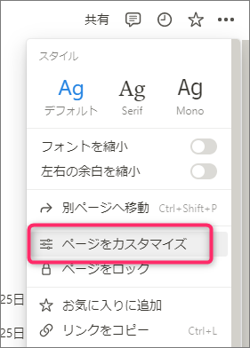

ここではページに表示されるコンテンツのカスタマイズができます．ページに表示されるプロパティの順番と，プロパティの表示条件を設定します．以下は私の設定です．ご自身でお好きなようにカスタマイズしてください．

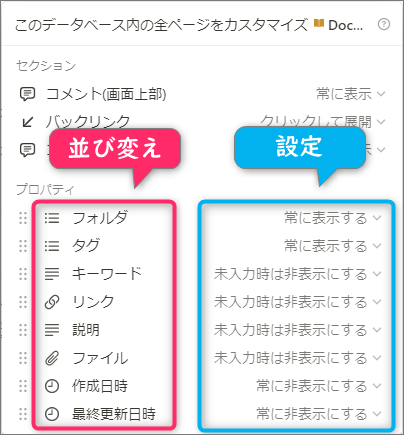

これでドキュメントデータベースの設定は終わりです．


ドキュメントデータベース以外のデータベースページを `DB` ページに追加していきます．例えば，Books とか，Bookmarks、Journal とか．

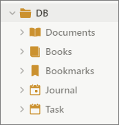

次に，メインページを作成します．ダッシュボードみたいなものです．ダッシュボードページもドキュメントデータベースに入れていきます．名前は `ダッシュボード` とし， `フォルダ` には `dashboard` に設定します．
作成したページを開き，右上にある `★` を押すとお気に入りページに指定されます．

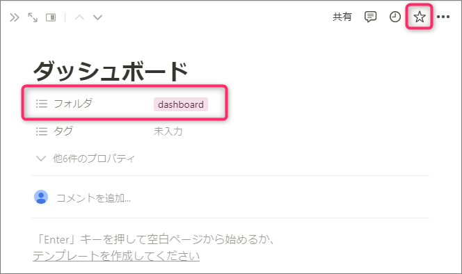

お気に入りページにするとサイドバーのお気に入りのところに追加されて便利です．

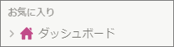

ダッシュボードページにブロックを追加していきますが，ここで追加するブロックはリンクドビューなります．リンクドビューは、各種ビュー形式を指定して作成することもできます．

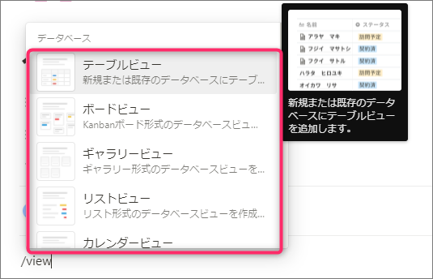

これで Wiki のような階層構造ではなく，データベースによる管理方法になりました．

## ビューの活用

データベースによる管理になったわけですが，ドキュメントが 100, 1000 と増えていきます．データベースは単一データベースにはせず、また作りすぎもよくないと考えます．どういうときに新規にデータベースを作成するかですが、プロパティが増えすぎにならない程度に調整するといいです．リンクドビューが使えるようになってから、データベースとビューを別々に管理できること、1つのリンクドビューに複数のデータベースを扱うことができるため、データベースはある程度数が多くなってもいいと思います．

基本的にドキュメントは編集中のもの，編集が終わって後から検索して参照する2つに分けることができます．ダッシュボードでは編集中のもの，新規にページを作成することが主になりますので，これに合わせたビューを作成します．編集中のものは `draft` フォルダに入れます．Documentsデータベースの `フォルダ` に `draft` を作成しておきます．

次にリストビューを作成します．

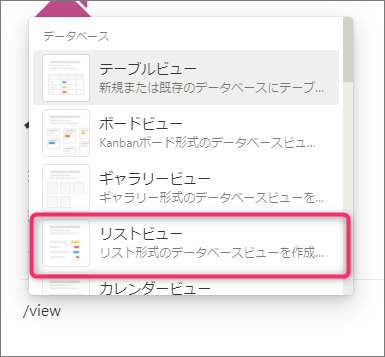

データソースには作成したDocumentsデータベースを設定します．

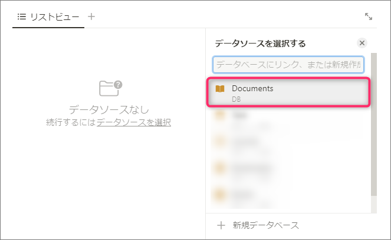

データソースを設定したら次はビューの名前とビュータイプの指定です．データソースを選択すると、そのデータベース固有のビューからコピーする画面になります．ここでは新規にビューを作成するので、`新規の空のビュー`を選択します．

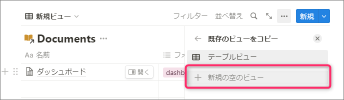

ここでは `ドラフト` という名前，ビューの形式は `リスト` になっていることを確認してください．

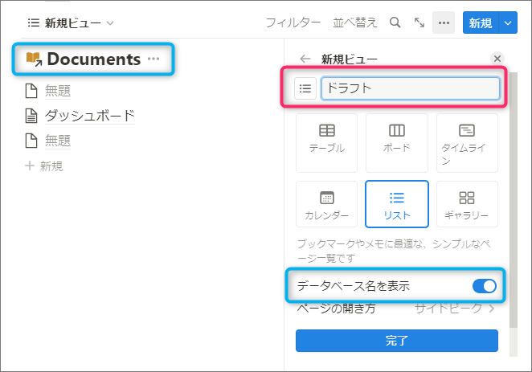

ビューの設定画面にある `データベース名の表示` は左上のデータベース名を表示するかしないかを設定できます．これは後からでも変更できます．

これでビューが作成されます．ビューを作成したら、ビューのオプション設定をしましょう．ビューの右上にある`･･･`をクリックして、`プロパティ`を選択します．

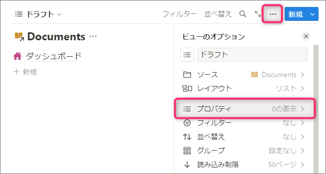

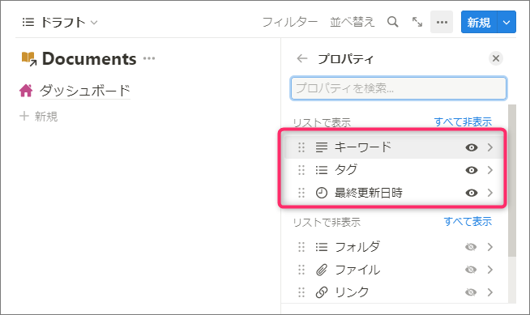

ダッシュボードに追加した Documents データベースのリストビューでフィルター設定を行います．
ビューの右上にある `フィルター` を押して `フォルダ` を選択します．

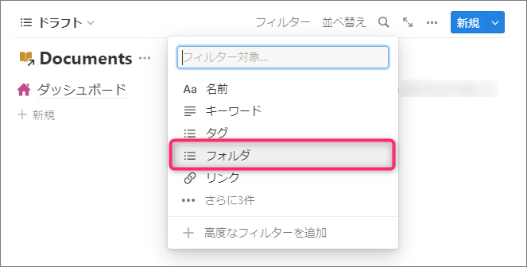

そして `draft` のみ選択します．

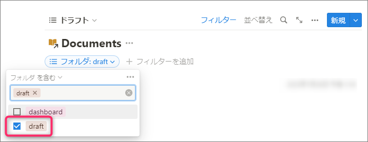

これでタグに `draft` が含まれているものだけが表示されます．フィルター設定のとき，マルチセレクトタイプは既に存在するオプションがないと設定できないため，適当にドキュメントを作ってオプションを作成しておきます．

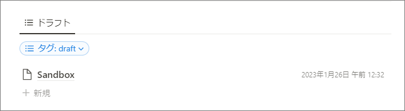

このように，フィルタリングされた状態になり，編集中のページを開きやすくなっています．

後はデータベースを作成して、ダッシュボードに随時ビューを追加していくようにしていきます．新規ビューはビューの隣にある`+`で追加することができます．

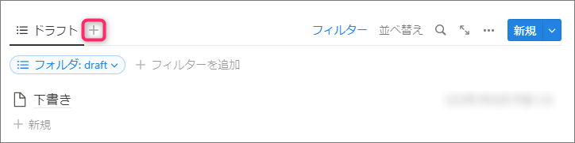

画面サイズが小さい場合、ドロップダウンにまとめられてしまいます．その場合は次のようにビューを追加できます．

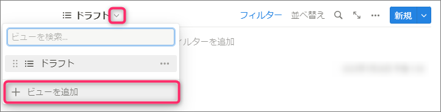

また、必要に応じてリンクドビュー自体を増やしても構いません．


## 検索

`Ctrl+P` で検索できます．また、サイドバーから`検索`でもできます．また、ビューのフィルターを使ってデータベースを絞り込み検索すると効果的です．そのために、タグやキーワードを上手く使います．また、特定のビュー内で検索する場合．右上にある虫眼鏡のアイコンをクリックすることで検索文字を入力することができます

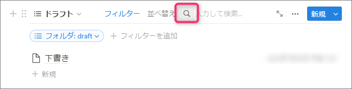


## タスク管理

ダッシュボードにタスクを追加しましょう．まずはDBページに `ボード` のデータベースページを追加します．名前は `タスク` とします．

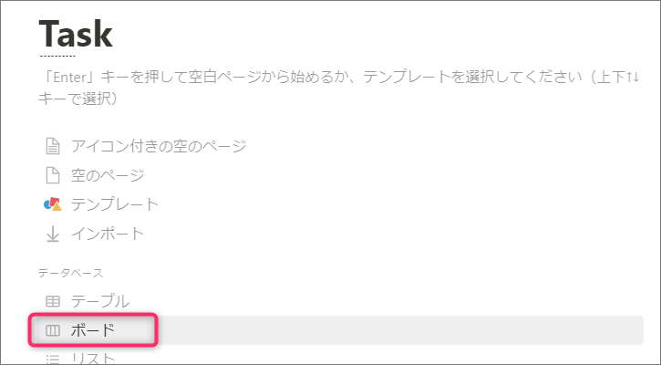

データベースは `新規データベース` を選択して新規に作成します．次のようなボードビューが作成されます．

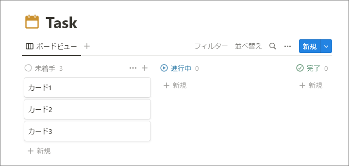

ステータスは`ステータスプロパティ`というものになっています．ボードビューでドラッグ＆ドロップすることでステータスを簡単に変更することができます．

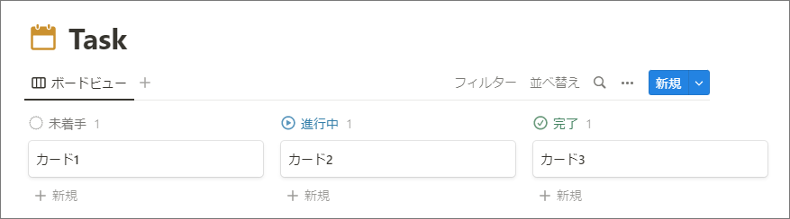

ダッシュボードにタスクデータベースのカレンダービューを設置したいのですが，そのまえにカレンダービューに対応するために `日付` プロパティを追加します．

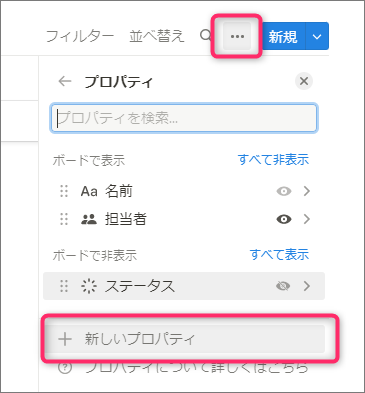

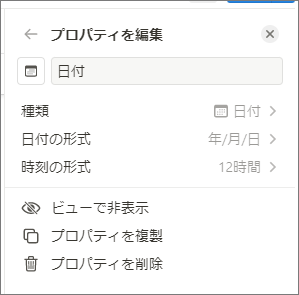

これで準備できました．早速ダッシュボードにまずはカレンダービューを作成します．データソースは作成した Task データベースを選択します．

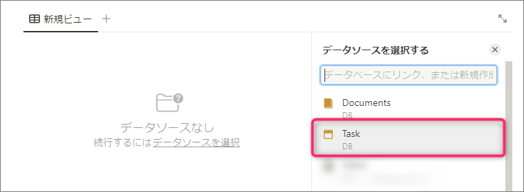

カレンダービューの日付に対応するための設定 `カレンダーの表示基準` の項目が作成した `日付` プロパティであることを確認します．

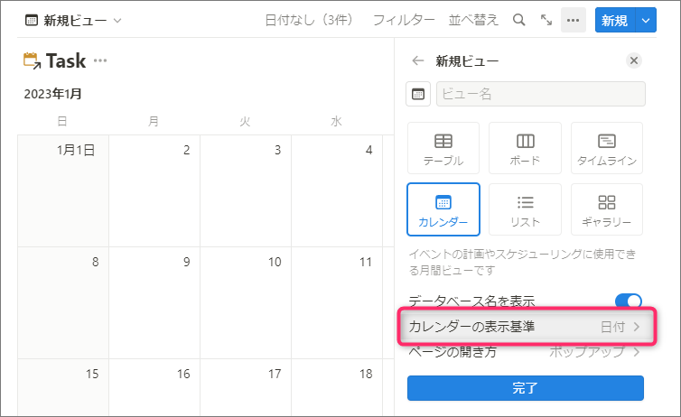

適当にビューの名前をつけてビューを作成します．
タスクの `日付` プロパティに日付を設定していればカレンダービューにも反映されます．

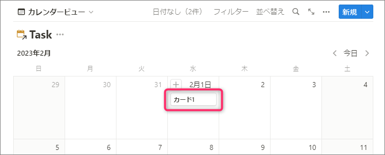

次にタスクのリストビューを作成します．

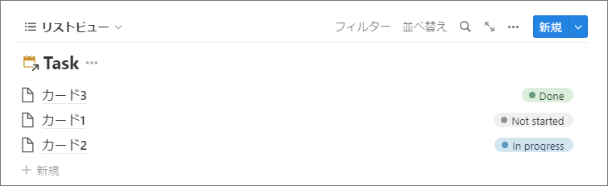

フィルターの設定をします．

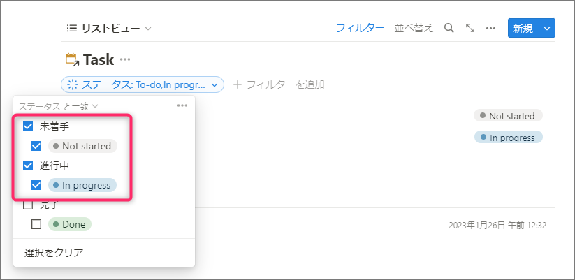

日付順でソートするように設定します．

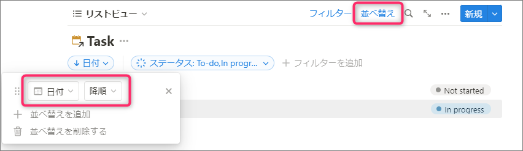

使いやすいように他のビューを作成してフィルターやソートの設定をしてみてください．


## ここまでのまとめ

新しく管理するデータベースをDBページに追加します．ダッシュボードおよびそのサブページなどでリンクドビューを使って参照します．ドキュメントは Documentsデータベースに作成していきます．ダッシュボード以外の特定のダッシュボードに相当するページも Documents データベースに入れていきます．基本はこの流れです．


## JournalデータベースとBookmarksデータベース

Web Clipper や Twitter などのSNSからの共有にも Notion は使えます．そういったサービスからの入力は `Journal`データベースや`Bookmarks`データベースに入れます．この2つのデータベースは1つにまとめてもらっても構いません．使い方としては、Journalデータベースは日付に強く関係しているもの、例えばニュースなどその日に起きたことなどです．また、このデータベースに日記を書く使い方もできます．Bookmarksデータベースはそれ以外のものに使います．それでは、DBページにJournalデータベースとBookmarksデータベースのサブページを作成します．

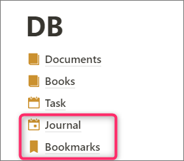

ブラウザの拡張機能 `Notion Web Clipper` を使ってNotionに保存するときのデータベースに`Journal`や`Bookmarks`を選択します．

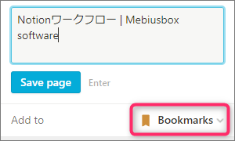

:::info
`Notion Web Clipper` を使って保存するときにタグなどの情報を同時に設定できません．その場合は保存してから Notion でページを開いて設定します．
:::

Chromeのブラウザ拡張機能 `SaveToNotion` を使うとクリップ時に細かい設定が可能です．


## 最終的なページ構成

ということで，DB ページ以下に各データベースがあるだけの構成になります．各ページはいずれかのデータベースに含まれています．大分スッキリしていると思います．

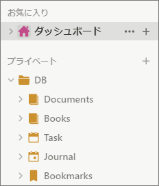


## アイコン

ページごとにアイコンを設定できます．標準で用意されているアイコン以外に絵文字や自分で用意したもの（カスタムアイコン）を使うこともできます．

もともと、アイコンは絵文字とカスタムアイコンのみでしたが、標準で使えるアイコンが追加されました．さらに色もいくつか指定できます．

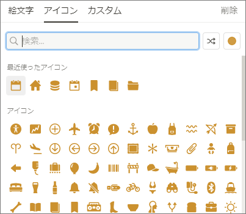

私は、このアイコンを使ってページを視覚的にわかりやすくしています．使っているのは基本4色です．

(Lightテーマ)


(Darkテーマ)


マゼンタ色はダッシュボード、黄色はデータベース、青色はテンプレート、緑色は重要なページとして使っています．特にデータベースはリンクドビューや外部ツールで指定することも多く、検索でデータベースページかどうかがわかりやすくなるので、アイコンを設定することをオススメします．

アイコンの種類に関しては過剰にさまざまな種類のものを設定しないほうがいいと思います．適切なアイコンがなければ一貫して同じアイコンを使うべきだと思います．


## ギャラリービューを使ったビューの管理

リンクドビューにビューを多く作ってしまうと、画面に表示しきれずにドロップダウンにまとめられます．たとえ多く作らなくても画面サイズが小さいと、2つでもドロップダウンにまとめられます．個人的にそれは使いづらく感じました．
そこで、ギャラリービューを使うとかなりマシになります．具体的にはギャラリビューで作成したデータベースの各ページがビュー1つに対応するようになります．この方法だとビューの切り替えがボタンになります．スマホなど画面が小さいものだとかなりストレスフリーになります．例えば、普通にリンクドビューにビューを作成すると次のようになります．


ギャラリビューにすると、次のようになります．


ただし、この方法にもデメリットがあります．まず、ビューを切り替えるごとにページも切り替わることになりますので、いくらか読み込みの時間が増えることになります．また、ビューを作るためにページを作らなければなりません．これはデータベースのテンプレート機能を使うことで軽減できます．
あと、この方法では Center Peek にするといいです．ビューを切り替えるときに最初のリンクドビューの画面で操作できます．ただし、スマホやタブレットなどの場合はこれができません．あと、Center Peek の場合、前の画面に戻る場合はショートカット `Ctrl+[` を使うと1つ前のビューに戻ります．そうでないと最初のリンクドビュー画面まで戻ります．


## 命名規則

ページが多くなってくるとダッシュボードやサイドメニューからのナビゲーションも重要になってきますし、検索も使うことになってきます．検索を使う場合、ページ名に規則性を持たせると目的のページが見つかりやすくなります．

### ページ名

私の場合、以前は `..{id}` をページの後ろに追加していました．例えば、`Dashboard..da` とし、検索時は `..da` とすればこのページが検索結果でトップになります．現在は `| {key}` としています．例えば、`Dashboard | 1`、 `Task | DB`, `Javascript | Lang`、 `表現集 | Eng` というようにしています．ダッシュボード系は数字にしていてすぐに入力できるようになっています．それ以外だと主にカテゴリになっています．カテゴリで検索したい場合は `| {key}` と検索します．ただ、この方法だとそのページのリンクを作成すると表示が冗長に感じることがあります．

:::info
すべてのページに対して、この命名規則を適用しているわけではありません．主要なページのみです
:::

### データベース名

その他に、先ほど紹介したギャラリービューを使ったビューの管理をしている場合、そのデータベースには `_Views` という名前を一貫でつけています．また、DBページのサブページにないデータベースでよく参照する場合は、そのデータベース名に `| sDB` をつけています．これは Sub DB の意味ですが、なんでもいいです．（DBページにあるデータベースには `| DB`をつけています）

### 先頭に `_`

ページの先頭に `_` をつけると、検索結果の優先度が下がる（他の一致したページが優先される）ように感じました．そのため、検索結果に表示してほしくないものは `_` を先頭につけています．

### データベースやリンクドビューの標準ビュー

データベース、およびリンクドビューは必ず1つ以上のビューを持っています．ビューの中から標準ビューなものを選んで `Default` という名前をつけるようにしています．ただし、必ずつけているという訳ではありません．少なくともデータベースには Default ビューが存在するようにしています．


## バックリンク、ピン

Wikiのような階層型ではなく、データベース主体の管理方法では検索やビューの使い方が重要になってきます．といっても、最初は各ダッシュボードからそれぞれに対応したビューやページを辿っていくことになります．サブページであればその階層を辿ることができますが、データベースの子ページでは、親がデータベースになるので、ダッシュボードで子ページをリンクしている場合、データベースの子ページからそのダッシュボードに戻れるリンクがあると便利な場合があります．基本的にブラウザの戻るでいいのですが、バックリンクでもダッシュボードに行けるようにします．そんため、ダッシュボードにピン用のコールアウトを作成します．そこにバックリンクを貼るページをリンクします．これで、ピンしているページはダッシュボードからすぐにアクセスできるし、バックリンクで戻ることも可能になります．


## 私のテンプレート

テンプレートを公開しています．興味があれば活用してみてください．


### Workflow

ここで紹介しているワークフローのテンプレートです．

https://mebiusbox.notion.site/Workflow-d174512bebd14cf1997b8bfd150a4bb9

### Structured Notebook

1つのページが肥大化してしまったり、1つのトピックでドキュメントをまとめたい場合のために作りました．1つのトピック＝1つのデータベースで管理します．詳しくは、テンプレートの「はじめにお読みください」を参照してください．

https://mebiusbox.notion.site/Structured-Notebook-294e2a7b7ee84d60b86ba19dba827345


### WBS

サブアイテム機能を使って WBS (Work Breakdown Structure)を管理するテンプレートです．詳しくは、テンプレートの「はじめにお読みください」を参照してください．

https://mebiusbox.notion.site/WBS-c33e10534921465d93f6604948302c81


## Notion デスクトップ

Notion デスクトップにタブ機能が追加されて使いやすくなりました．また、Web版よりも高速らしいので、Web版で遅いと感じたら試してみてください．

ちなみに個人的には、Notionデスクトップを使うことはまだないかなと思っています．まず、Web版のブラウザ拡張機能が使えないことが1番大きいです．独自の拡張機能を作成したり、Stylusでフォントなど見栄えを変更しているため、これがないと使いづらいです．また、私の環境だけかもしれませんが、Notionデスクトップに切り替えると入力を受け付けないことが多々あって困っています．ウィンドウを切り替えると正常になるのですが、若干手間です．

ただ、このような記事を書くときに通常の表示を確認できるので重宝しています．


## Notion ですべてやろうとしない

Notionの機能を知ってくるといろいろなことをNotionでやりたくなります．もちろん、それは決して悪いことではないのでどんどん挑戦してもらって構いません．ですが、慣れれば慣れるほどシンプルになっていく感じはします．あまり、こだわると後が大変ですのでほどほどに．

Notionはいろいろな状況に対応できるほどポテンシャルを持っていますが、特に注意したいのが「Notionは必ずしもベストではない」ということです．例えば、最初デザインの資料などもNotionで管理しようと思っていたのですが、結局アップロード上限や画像、動画のブラウジング能力はそんなに高くないです．また、家計簿のようなものもNotionで作ることは可能ですが、Notion以外のアプリが既に洗練されているので、そちらを使った方が良いです．スプレッドシートもそうで、Notionのシンプルテーブルやサブアイテムによるセル参照といったこともある程度可能ですが、普通にGoogleスプレッドシートやExcelを使ったほうがいいです．


## Notion以外のツール

例えば、OneNote や Obsidian、EverNote などさまざまな類似ツールがあります．それぞれ良さがありますので、どれが一番というのは決まらないと思っています．Notion は「データベース」をいかに使いこなせるかにかかってくると思っています．なので、とくにデータベースが必要ないのであれば、Notionを使う理由もあまりない気がします．

OneNoteは手軽ですし、今は無料で使えるし、手書きが標準でサポートされているのがいいかなと思っています．

[Obsidian](https://obsidian.md/)はノートとノートをつないでネットワークを構築していくのが重要だと思っているのですが、正直面倒くさいです．あれはマメ、完璧主義といった人たちが使うといいのでは、と思っています．面倒くさがりな私はちょっと馴染みませんでした．

[BoostNote](https://boostnote.io/)は使っていたんですが、有料化してしまったので今は使っていません．大分進化しているようで Notion のような感じになっていました．

テキストベースで十分という場合、Notion を使うメリットがほぼないです．


## Notionの活用

私は次のような感じで Notion を使っています．


また，スマホやタブレットでは外部記憶装置として Notion を使っています．


## 便利な機能

ここでは，Notion にある便利な機能をいくつか紹介します．


### 絵文字

Notion では絵文字をサポートしています． `/emoji` と入力したり，Windows なら `Win+.` で簡単に入力することができます．あまり使いすぎると逆に見づらくなるかもしれませんが，上手く使うことで文書がとても見やすくなります．例：


また，ページについては

- 📘まとめページ．体裁の整ったもの，公開ページ．
- 📝編集中

あと，データベースの新規ドキュメントでアイコンを指定しない場合は断片的なメモ


という感じで，使っています．


### Toggle list, Callout, Gallery(DB), Board(DB)

Notion では，これらを使いこなすことでレイアウトやデザインを良くすることができます．ユーザーが公開しているテンプレートを見てみるとこれらをうまく使っているケースが多いかなと思います．

まず，Toggle list は折り畳み可能なブロックです．


Toggle list を並べる場合は，色をつけると視認性が少し良くなります．


次に Callout はアノテーションなどに使います．


この Toggle list と callout を組み合わせることでレイアウトを整えていきます．


このように Callout の背景色を設定して，中に Toggle list を入れていくといった感じで作成します．もちろん，さらに入れ子にもできるし，インラインデータベースだって入れることができます．

これ以外に Database の Gallery ビューを使ってレイアウトする方法があります．


この場合は，データベースのオプションから `Properties` を選択， `Card preview` を `None` ， `Card size` を `Small` に設定します．

また，データベースの Board ビューもページナビとして使いやすいです．


:::info
データベースの背景色は直接設定することはできませんが，Toggle list や Callout の中にデータベースを含めることで，擬似的に背景色を設定することができます．この場合，背景色は Toggle list や Callout 側で指定します．
:::


### Synced Block

同期ブロックというもので，異なるページ間でもブロックコンテンツを共有することができます．これを利用して，各ページのサイドページ部分を作るといったことができます．適当なダミーページを作成して，そこに段組した状態のサイドページ部分を Synced Block で作成します．あとは各ページにそれを埋め込んでいくような形になります．


### Table

データベースページとは異なるもっと単純な表を作成することができます．以前はデータベースを作らなければいけなかったのですが，こちらを使いましょう．


テーブルは本当に単純にできているので，実際に使ってみると機能が足りないと感じることがあります．例えば，一括で行を削除できなかったり，セルの操作が微妙にやりづらかったりします．その場合は，一度データベースに変換してから編集してみてください．テーブルからデータベースに変換するコマンドが用意されています．


データベースに変換すると次のようになります：


あとはデータベースの状態で編集してから，テーブルに戻します．


:::caution
この方法の注意として，テーブルに行ヘッダーがなければ勝手に追加されてしまうことです．また，データベースの状態でフィルターやソートなどの指定をしても，テーブルに戻すとリセットされます．
:::


### リマインド機能

データベースのプロパティに `Date` タイプを追加すればリマインド機能を利用することができます．


指定した日付からどれくらい前に通知するかを選択することができます．ブラウザやデスクトップでは `All Updates` のところで知らせてくれます．スマホアプリの場合だとプッシュ通知されます．


### 数式

今では，ブロックおよびインラインでの数式がサポートされています．実は数式は `TeX` で入力するのですが，これを使ってレイアウトに生かすことができます．

$$
\LARGE\textbf{\textsf{Header}} \\ \large\textsf{Sub Heading}
$$

```latex
\LARGE\textbf{\textsf{Header}} \\ \large\textsf{Sub Heading}
```

また，このページの先頭にある `CONTENTS` の部分にも使っています．

背景色を設定するにはコツがあって，まず空のブロックを作成して先に背景色を設定します．そしてコンテンツには数式を入力しておいて，最後に `Turn into` で数式ブロックに変換します．

$$
\tiny\bullet
$$

今度はインライン数式を使ったちょっとしたテクニックを紹介します．これを使うと文書内にマーカーっぽい表現を行うことができます．ただし，本来のインライン数式の使い方ではないので，多用は禁物ですし，将来的に使えなくなる可能性も否定できません．

本来，Notion 上でのテキストの色や背景色は特定の種類しか設定することができません．ですが，インライン数式を使うことで $\color{#FFF}\colorbox{#DD4A48}{\textsf{こんにちは！}}$ というようにユーザーが指定した色の背景色を設定することができます．Notion の標準の赤背景ですと こんにちは！  (この部分は Notion だと背景色が変わっています）というようになります．これを使うことで， $\color{#191919}\colorbox{#FFE162}{\textsf{黄色}}$ ， $\color{#191919}\colorbox{#86C6F4}{\textsf{青色}}$ といったことが可能です．これは次のような数式になっています：

```latex
\color{#FFF}\colorbox{#DD4A48}{\textsf{こんにちは！}}
```

また，インライン数式なので，データベースのプロパティに設定することができます．


インライン数式やブロック数式は汎用性が高いです．他にも，本文で使われている次の区切りも数式ブロックです：

$$
\tiny\bullet
$$

### データベースでの進捗ゲージ

データベースには `Formula` という数式プロパティを利用することができます．これを使って進捗ゲージを自動で示すことができます．表現方法は様々なので色々探してみてください．例えば


上記の Formula は下記の通りです：

```jsx
if(not empty(prop("Completed")) and not empty(prop("Tasks")), slice("■■■■■■■■■■", 0, floor(10 * prop("Completed") / prop("Tasks"))) + slice("❒❒❒❒❒❒❒❒❒❒", 0, 10 - floor(10 * prop("Completed") / prop("Tasks"))) + " " + format(floor(100 * prop("Completed") / prop("Tasks"))) + "%", "")
```

興味があれば以下のサイトも見てみてください．いろんな進捗ゲージを表す数式がまとまっています．

https://www.redgregory.com/notion/2021/6/4/17-progress-bar-designs-in-notion


:::info
数式や値のプロパティで進捗ゲージを表示できるようになりました．


:::


### データベースで特定のデータをピン留め

データベースのデータ数が増えてくると，最初に表示される数が制限されることがあります．最初に表示される最大数はデータベースのプロパティで選択することができます．データベースで一括管理しているデータ数が多くなってくるので最初に制限された状態で表示されることも多くなってくることがあります．その場合はフィルターなどで調整するのですが，それとは別に常に特定の項は先頭に表示することができると便利です．ここではその方法を紹介します．例えば次のようなデータベースを作成します．このデータベースにはデータ数が 10 個以上あり，プロパティで最大 10 個表示に設定しています．


初期状態だと最大 10 個しか表示されておらず， `Load 50 more` をクリックすると表示されるデータ数が増えていきます．このデータベースがすべて表示された状態は次のとおりです．


ここで `Game` は初期だと非表示状態ですが，これを常に先頭の方に位置するようにしてみます．

まず，新規に `Pin` という項目を `Checkbox` で作成します．


作成したら `Game` の `Pin` にチェックをつけます．


次にソートを追加します． 対象を `Pin` ，順番を `Descending` に設定します．


これで， `Game` が先頭に来ます．


あとは， プロパティから `Pin` を非表示にして完了です．


もし，ソート条件を追加する場合は `Pin` の条件が一番上になるようにしてください．


ピン留めしていることをわかりやすくするために絵文字を入れるのもありだと思います．


### データベースの項目を一気に全画面表示で開く

Notion のデータベースはページの集まりです．各データはページとして開くことができます．普通はデータの `Name` プロパティにカーソルを合わせて `OPEN` (開く) をクリックします．


:::info
2022年７月のアップデートで「開く」にサイドピークおよびフルページで開くオプションが追加されました．詳しくは[こちら](https://www.notion.so/help/views-filters-and-sorts#open-pages-as)．
:::

デフォルトではサイドピークになっています．これは画面の右側にプレビューが表示されます．全画面表示するには，プレビューモードから左上にある `Open as full page` をクリックする必要があります．


`Open` ボタンをサイドピークではなくフルページで開くように設定することができます．


サイドピークも便利なため場合によって使い分けられると便利です．残念ながら現在はどちらかしか選べません．ちなみに `Ctrl` キーを押しながら開くと新しいウィンドウで開きます．

サイドピークをデフォルトとすると，一度プレビューを開いてから，全画面表示と２回遷移する必要があるため，とても無駄に感じることがあります．そこで，ビューから直接全画面表示する方法を紹介します．

まず `URL` プロパティを使ってページのリンクを設定する方法が考えられます．これはページのリンクをコピーして貼り付けるだけなのでとても簡単です．ただし，ブラウザ上で作業している人ならこれで十分なのですが，Desktop版を使用している場合はこれではできません．プロパティにはブロックを含めることはできませんが，インラインなら使えるものがあります．まずはテキスト形式のプロパティを作成します．ここでは `Full Mode` としました．そこに `@` や `[[` を使って対応する項目へのリンクを作成します．


あとはリンクをクリックすれば一気に全画面表示で開くことができます．ただし，この方法は Table ビューでしか使えないので注意してください．とはいえ，開くページのコンテンツが大きいほど，プレビューモードを経由して全画面表示すると無駄な処理が増えるので，あらかじめ全画面表示するつもりなら，こちらのほうが手っ取り早いとは思います．

:::info
上記以外でも，テキストや絵文字にページへのリンクを設定することも可能です．さらにトリッキーなことをすると，一度リンクを設定したテキストや絵文字を Name プロパティにコピペすることも可能です．絵文字に設定すれば見た目的にスッキリするので悪くない方法ですが，ちょっと手間になります．
:::

:::info
プレビューを開いた状態でショートカットキー `Ctrl+Enter` でも `Open as full page` と同様にページを開くことができます．
:::


### データベースの最近更新された項目を表示する

新規にデータベースを作成したときの標準ビューにおけるソートは厳密な項目の作成順になっているようです．データベースの最近更新された項目を表示するには，データベースのプロパティから `Last edited time` を追加してソートするように設定すればできます．

:::info
データベースのプロパティで `Created time` を追加してソートするようにした場合，標準ビューとは異なる順番になる場合があります．`Created time` でソートするほうは年月日は良いのですが，時間は無視しているように見えます．
:::


### データベース内の特定のタグ（マルチセレクト）が設定されたページをカウントする

ステータスプロパティを使うことで簡単にカウントできるようになったのですが，既にマルチセレクトで構築してあるデータベースをステータスプロパティに切り替えるのが難しい場合があります．ステータスプロパティは３種類（`To do`, `In Progress`, `Complete`) のグループのみとなっているので，すべてのマルチセレクトがステータスプロパティに置き換えられるわけではありません．

個人的に思いついた方法として２種類紹介します．


### フィルターを使ってカウント

例えば Table ビューなどの下部には集計値といった値を表示する機能があります．フィルターでカウントしたいタグを設定して，ここの集計値で確認します．


これがお手軽ですが，一度に１つのカウントしか確認できないため，ビューを作成したり，毎回フィルターを設定したりする必要があります．なにより一度に複数のカウントを確認することができません．（ビューブロックそのものを複数配置というのもありえなくはないですが…）


### Relation, Rollup, Formula を使ってカウント

そこで，少しトリッキーな方法です．

1. 集計対象のデータベース（`SampleDB`）があるとします．
2. 集計用のデータベース（`SampleDBCount`）を作成します．
3. この２つを Relation で接続します（`※1`)．
4.  `SampleDBCount` で適当な項目（ここではとりあえず `ALL` とします）を作成します．
5. `SampleDB`でかつ集計対象としたいページに Relation で設定した項目の値を `ALL` に設定します．
6. `SampleDBCount` で，Rollup プロパティを作成し，`SampleDB` のタグ（マルチセレクト）を選択します．計算は「オリジナルを表示する (Show Original)」 を選択します．
7. `SampleDBCount` にカウント用のプロパティを Formula タイプで作成します．例えば，`ToDo` というタグのカウントをしたい場合は次のような数式を設定します： `(length(prop("Tags")) - length(replaceAll(prop("Tags"), "ToDo", ""))) / length("ToDo")`

`※1`: `SampleDB` と `SampleDBCount` のリレーション


結果は次のようになります：


何をしているかというと，ロールアップによって対象のページの全てのタグが１つにまとめられます．重要なのは，ロールアップの計算を「オリジナルを表示」に設定することで，設定されているタグが重複関係なくすべて１つにまとめられます．それは Formula から１つの文字列として参照できます．そこで，数式では文字列からカウントしたいタグの文字列を置換して削除し，削除前と削除後の文字数の差分を使ってカウントを求めています．これでカウントしたいタグ（マルチセレクト）ごとにプロパティを作成して数式を設定すれば一度に複数のカウントを確認することができます．ただし，この方法の欠点として次のようなものがあります：

- カウントしたいタグ（マルチセレクト）の文字が他のタグに含まれているような場合には上手くいきません．具体的には例えば，`notion` というタグをカウントするときに `notiontwt` というタグがある場合には上手くいかない
- 複数タグでカウントすることはできなくもないですが数式が複雑になる
- 集計対象のデータベースにリレーションする必要がある

あらかじめ集計するということがわかっていればマルチセレクトではなく別にデータベースを作成してリレーションし，ロールアップしておけば苦労せずに済みます．ただ，セレクト側の数が多くなるとリレーションプロパティを設定するときに項目の表示に時間がかかるようになったり，見た目的にもマルチセレクトの方が好みだったりします．


### トグルヘディング

トグルヘディングとは，見出しがトグルリストになったものです．通常の見出しではなくトグルヘディングを使うと画面がスッキリして整理しやすくなります．ただし、トグルヘディングは多用するとページが重くなります．


### マルチカラム作成

マルチカラムブロックの作成が一気にできるようになったみたいです．


### テンプレートボタン

例えば，あるタスクのToDoをまとめて作成してタスクの消化をしたい場合があるかもしれません．そのタスクがデイリーだったり，慣習的に行われるものならば，毎回ToDoのチェックボックスを作成するのは面倒です．Todoが沢山あるなら尚更です．そこで，Notion にはテンプレートボタンという機能があります．あらかじめ指定したテンプレート（ブロック群）を用意しておき，ボタンを押すと一発で作成してくれるものです．使用するには `/button` または `Template Button` ブロックを作成します．

テンプレートボタンで作成するブロックは単一ブロックでも問題ないので，例えば単純な ToDo リストやそれ以外のリストでよく追加・削除をする場合にはテンプレートボタンを配置したほうが楽な場合があるかもしれません．テンプレートボタンで作成したブロックはボタンの直下に作成されますので，水平線を置いておくと，どこまでがボタンで作成されたものなのかわかりやすくなります．


### カラーサンプル


    


### カバー

ページの先頭にはアイコンやカバーを設定することができます．自分で画像を用意することになりますが，例えば以下のようなサイトでおしゃれなカバーを作成することができます．

https://covercons.vercel.app/


### Notionで使えるアイコン

Notion には絵文字がありますが，アイコンも文書の見栄えを良くするために利用できます．また，Notion 用に使いやすいアイコンが多く公開されています．

https://pablom.io/resources/icons

https://www.notion.vip/icons/

https://super.so/icons

https://notionv5.vyshnav.xyz/


これらを使うとこんな感じで調整できます：


:::caution
このようなアイコンは，ライトテーマ用とダークテーマ用にそれぞれ用意されている事も多いです．個人用途だったら特に問題はないと思いますが，多人数で共有している場合は，人によって使用しているテーマが違うことがあるので注意が必要です．
:::

:::info
テンプレートなどを見てみると絵文字にはない小さなアイコンが設定されているものを見かけることがあります．これはページに設定されているカバーアイコンが小さく表示されています．ページへのリンクを作成するときにテキストと絵文字を組み合わせるのもいいですが，独自のアイコンを使いたい場合はインラインのページリンクを作成して，そのページのカバーアイコンで独自の画像を設定することができます．
:::


### ダークテーマ

Notion にはダークテーマが用意されています．設定から全体に対して適用できたり，ページを開いている状態で `Ctrl/Cmd+Shift+L` で切り替えることができます．ただ，最近のダークテーマは変更が頻繁で人によっては見やすくなったり見づらくなったりと全く安定していません．なので，色を設定するときは気をつけたほうがいいです（例えば，Brown, Orange, Yellow を混ぜて使わない，Pink と  Red も同様といった感じです）．


### Stylus

Notion のデザインはライトテーマだと問題ないのですが、ダークテーマはどうも視認が悪いです．泥色っぽくイマイチです．また、フォントも日本語は見やすいとは言えません．そこで、ブラウザの拡張機能を使ってカスタマイズします．いくつか方法がありますが、ここでは Stylus の方法を解説します．Stylus は Chrome の拡張機能で指定のURLごとスタイルシートをカスタマイズできます．

:::caution
この方法はWeb版Notionを利用している場合に有効です
:::

まず、新規スタイルを作成して「ドメイン上のURL」を`notion.so`に設定します．
以下に各設定を記述します．ダークテーマでの設定です．`!important`を忘れずに．

```css
/* サイドバーの設定 */
div.notion-dark-theme .notion-sidebar-container {
  ...
}
/* 背景 */
div.notion-dark-theme .notion-frame {
  ...
}
/* フォント */
div.notion-dark-theme div {
  ...
}
/* コードブロック */
div.notion-dark-theme .notion-code-block * {
  ...
}
/* 引用 */
.notion-dark-theme .notion-quote-block {
  ...
}
/* スクロールバー */
div.notion-darkt-theme .notion-scorll::-webkit-scrollbar {
  ...
]
```


### 日付ウィジット

個人的に欲しかったので作成しました．すでにサードパーティ製であるのですが、登録が必要だったので．また、お手軽に作れることもわかったので試してみました．
下記の４種類があるので、お好みのものをコピペして埋め込みブロックを作成してください．
ただし、Windowsでしか確認していないので、MacOSでは見た目が大きく違うと思います．


```
https://mebiusbox.github.io/notion_widget/
```


```
https://mebiusbox.github.io/notion_widget/mmdd.html
```


```
https://mebiusbox.github.io/notion_widget/ja.html
```


```
https://mebiusbox.github.io/notion_widget/mmdd_ja.html
```

:::caution
将来的にこのURLは無効になる可能性があります．
:::


### 入力支援

定型文などの入力に入力支援ソフトを使用しているのですが，それを Notion で使用する場合，特に数式ブロックなどの場合はどうすればよいでしょうか．それは `/turnblock` を使います．例えば，次のように使います．

```
\small\bullet/turnblock
```

## Tips

<Tweet url="https://twitter.com/NotionHQ/status/1201643288215711746" />
<Tweet url="https://twitter.com/NotionHQ/status/1187803533975969792" />
<Tweet url="https://twitter.com/NotionHQ/status/1191491580282228737" />
<Tweet url="https://twitter.com/NotionHQ/status/1188941028205744134" />
<Tweet url="https://twitter.com/NotionHQ/status/1204524791706902528" />
<Tweet url="https://twitter.com/NotionHQ/status/1471887587950272515" />
<Tweet url="https://twitter.com/shogocat/status/1504201337960996864" />
<Tweet url="https://twitter.com/TomFrankly/status/1509556530294804486" />

## Shortcuts

https://www.notion.so/help/keyboard-shortcuts

https://cheatsheets.namaraii.com/notion.html

https://imdave.notion.site/imdave/Notion-Shortcuts-dcb67fede8b24d6bb5fe2c0cae775d9a


## Integrations

https://notionintegrations.com/

https://apption.co/

https://notionlytics.com/

https://indify.co/


## 最後に

例えば，1つのプロジェクトのドキュメント管理，または攻略サイトのように1つのテーマに絞って情報をまとめあげる場合には Wiki で十分な場合もあります．ただし，個人・団体における集合知のようなナレッジベースを構築する場合には Wiki のような階層型による管理方法では必ず破綻します．なので，それぞれの扱うテーマごとにダッシュボードページを作成し，DB以外のすべてのページが必ずDB以下のデータベースのどこかに含まれているように管理を徹底することをオススメします．そのため，リンクページやリンクドビューを多用しましょう．ただし，あるページのサブページもすべてDBに含めなければいけない，という訳ではありませんので注意してください．

参考になれば幸いです．

<Bookmark name="Notion - One workspace. Every team." url="https://www.notion.so/?r=9dd2164b43634715ab450cdf6b3e7dce" description="招待ページです" />

