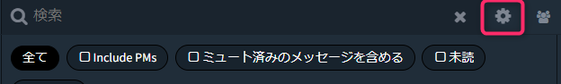
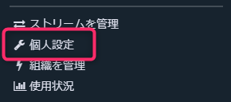
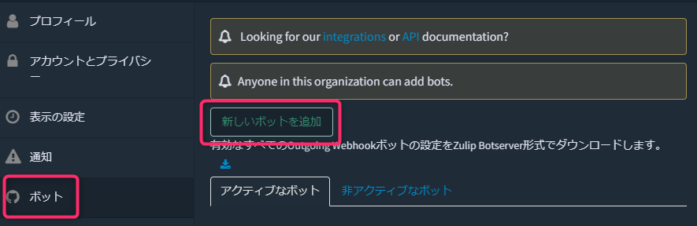
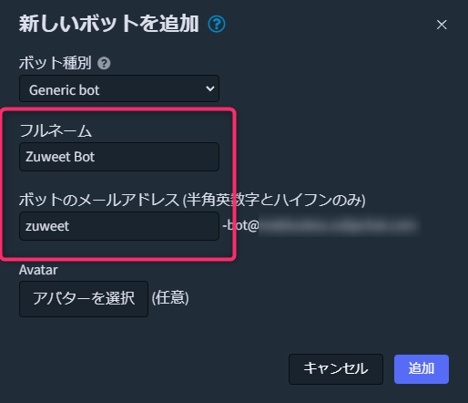
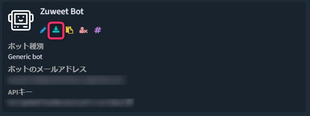
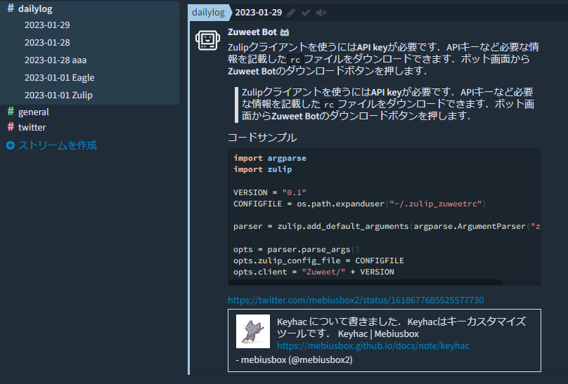

Zulip はオープンソースのチャットツールです．

https://zulip.com/

ZulipはSlackライクですが、 **チャネル** に相当する **ストリーム** の他に、Zulipには **トピック** があります．トピックがあるとディスカッションが明確になり、結論に辿りやすくなると思っています．Redditや2ちゃんねるのようにカテゴリ＋スレッドがストリーム＋トピックのようになっています．例えば、Rustの日本語コミュニティではZulipを使っていますが、閲覧するだけなら掲示板のように見ることができます．

https://rust-lang-jp.zulipchat.com/


今回はZulipを使ってデイリーログを書く仕組みを構築したのでその紹介です．


### 動作環境

```
Windows 11
Python 3.9.15
```


## どのように使うか

基本として、ターミナルからメッセージを入力してZulipに送信します．また、[Keyhac](https://sites.google.com/site/craftware/keyhac-ja)などと組み合わせることで、ターミナルを経由しなくても送ることができます．Keyhacについては以下を参照してください．

http://mebiusbox.github.io/docs/note/keyhac

:::info
もともと、ターミナルからのコマンドを手軽に記録したいのが目的でした．Jupyter Notebookのようにコマンドとその結果を記録できると便利です．私は[Notion](https://notion.so)を使っていますが、Notionになんでも記録するよりかは、まずはどこかにバッファして、後から整理したいと考えていました．
:::


## Bot

ZulipではプログラムなどからZulipにメッセージを送るなどの処理をするためにBotを作成します．Botは3種類あって、一般的なもの(generic bot)、外部から来るもの(incoming webhook)、外部に向かうもの(outgoing webhook)があります．

Botを作るには、Zulipの設定から**個人設定**を選び、**ボット**ページを開いて、**新しいボットを追加**ボタンを押します．

(Zulipの設定)



(個人設定)



(ボットの作成)



デイリーログが目的ですが、汎用的なボットを作成しますので、**zuweet**という名前にしました．tweetのzulip版です．アバターは任意で設定してください．



これでボットが作成されました．


## Python の Zulip クライアント

Zulipは公式でPythonとJavaScriptのクライアントライブラリを提供しています．

https://zulip.com/api/client-libraries

今回は Python ライブラリを使います．Zulipクライアントライブラリを`pip`でインストールします．

```python
pip install zulip
```


## API key

Zulipクライアントを使うには**API key**が必要です．APIキーなど必要な情報を記載した`zuliprc`ファイルをダウンロードできます．ボット画面から**Zuweet Bot**のダウンロードボタンを押します．



そのファイルをホームフォルダに保存します．ファイル名はそのままでも良いのですが、複数のボットを管理したいときのために、別名にしておきましょう．次のようにします．

```
~/.zulip_zuweetrc
```

`.zulip_zuweetrc`ファイルの中身は`api`セクションがあって、`email`、`key`、`site`が設定されています．


## Zuweet

まずはひな形です．

```python
import argparse
import zulip

VERSION = "0.1"
CONFIGFILE = os.path.expanduser("~/.zulip_zuweetrc")

parser = zulip.add_default_arguments(argparse.ArgumentParser("zuweet"))

opts = parser.parse_args()
opts.zulip_config_file = CONFIGFILE
opts.client = "Zuweet/" + VERSION

client = zulip.init_from_options(opts)
```

`argparse`を使ってzulipの標準引数をベースにオプションを追加するようになっています．


### 単純なメッセージを送る

メッセージは`send_message`を使います．例えば、次のようになります．

```python
opts = parser.parse_args()
opts.zulip_config_file = CONFIGFILE
opts.client = "Zuweet/" + VERSION

client = zulip.init_from_options(opts)

request = {
    "type": "stream", 
    "to": "StreamName", 
    "subject": "TopicName", 
    "content": "hello"
}
result = client.send_message(request)
print(result)
```

`to`はストリーム名、`subject`はトピック名です．ストリームはあらかじめ作成しておく必要があります．トピックはなければ自動で作成されます．

### オプションで指定する

これらをオプションで指定できるようにします．

```python
parser = zulip.add_default_arguments(argparse.ArgumentParser("zuweet"))
parser.add_argument(
    "-s",
    "--stream",
    dest="stream",
    help="The stream to which to send message",
    default="dailylog",
    action="store",
)
parser.add_argument(
    "-t",
    "--topic",
    dest="topic",
    help="The topic to which to send message",
    default="zuweet",
    action="store",
    required=True,
)
```

デフォルトのストリーム名を**dailylog**、トピック名を**zuweet**としています．
次にメッセージも追加して送信してみます．

```python
parser.add_argument("-m", "--message", dest="message", help="The content of send message", action="store")

opts = parser.parse_args()
opts.zulip_config_file = CONFIGFILE
opts.client = "Zuweet/" + VERSION

client = zulip.init_from_options(opts)
stream = opts.stream
subject = opts.topic
content = opts.message
request = {
    "type": "stream", 
    "to": stream, 
    "subject": subject, 
    "content": content
}
result = client.send_message(request)
print(result)
```

### トピックを日付にする

デイリーログなので、トピックには日付を指定します．もちろん、自動で今日の日付にできると便利です．また、`日付 トピック`という指定もできるようにします．`datetime`モジュールを使って日付を自動で設定しましょう．トピック名の中に `{date}` という文字があれば今日の日付で置換します．

```python
import datetime

(...)

client = zulip.init_from_options(opts)
stream = opts.stream
subject = opts.topic.replace("{date}", str(datetime.date.today()))
content = opts.message
request = {
    "type": "stream", 
    "to": stream, 
    "subject": subject, 
    "content": content
}
result = client.send_message(request)
print(result)
```

### クリップボードの内容を送信

クリップボードの内容を送れるようになると便利です．そのため、`pyperclip`モジュールを使います．

```
pip install pyperclip
```

オプションで `--clip` を指定すると、クリップボードの内容を送ります．

```python
import pyperclip

(...)

parser.add_argument("--clip", help="Use a message from clipboard", action="store_true")

(...)

content = opts.message
if opts.clip:
    content = pyperclip.paste()
client = zulip.init_from_options(opts)
stream = opts.stream
subject = opts.topic.replace("{date}", str(datetime.date.today()))
request = {"type": "stream", "to": stream, "subject": subject, "content": content}
result = client.send_message(request)
```

### 引用として送信

Zulipはマークダウン記法をサポートしています．メッセージを引用として送信する機能を追加しましょう．`--quote`オプションを指定すると引用に変換します．

```python
parser.add_argument("--quote", help="Use a message as quote", action="store_true")

(...)

content = opts.message
if opts.clip:
    content = pyperclip.paste()
if opts.quote:
    quote_content = "```quote\n"
    quote_content += content
    quote_content += "\n```"
    if opts.message:
        content = opts.message + "\n" + quote_content
    else:
        content = quote_content

client = zulip.init_from_options(opts)
stream = opts.stream
subject = opts.topic.replace("{date}", str(datetime.date.today()))
request = {"type": "stream", "to": stream, "subject": subject, "content": content}
result = client.send_message(request)
```


### コードとして送信

引用と同様に、コードとしても送信できます．この機能を追加しましょう．

```python
parser.add_argument("-c", "--code", dest="code", help="Use a message as code", action="store")

(...)

content = opts.message
if opts.clip:
    content = pyperclip.paste()
if opts.code:
    code_content = "```" + opts.code + "\n"
    code_content += content
    code_content += "\n```"
    if opts.message:
        content = opts.message + "\n" + code_content
    else:
        content = code_content
if opts.quote:
    quote_content = "```quote\n"
    quote_content += content
    quote_content += "\n```"
    if opts.message:
        content = opts.message + "\n" + quote_content
    else:
        content = quote_content

client = zulip.init_from_options(opts)
stream = opts.stream
subject = opts.topic.replace("{date}", str(datetime.date.today()))
request = {"type": "stream", "to": stream, "subject": subject, "content": content}
result = client.send_message(request)
```

コードハイライトのために言語を指定します． `--code=python` となります．
また、メッセージも同時に送れるようにしています．メッセージはコード扱いではないので、そのコードが何なのか説明するときなどに使います．


### 整形

コードや引用を送信する場合、基本的にコピーしてクリップボードから送信することになりますが、インデントの問題があります．インデントもそのまま送信されてしまうので、ネストが深いと見栄えがよくありません．といっても、事前に整形するのも面倒です．ここでは、インデントのみ調整します．将来的にフォーマッタのような処理ができるといいのですが、割愛しました．インデントの調整は`textwrap`の`dedent`を使います．`--format`オプションを指定することで、整形するようにします．

```python
import textwrap

(...)

parser.add_argument("--clip", help="Use a message from clipboard", action="store_true")
parser.add_argument("--quote", help="Use a message as quote", action="store_true")
parser.add_argument("--format", help="Format a message", action="store_true")
parser.add_argument("-c", "--code", dest="code", help="Use a message as code", action="store")
parser.add_argument("-m", "--message", dest="message", help="The content of send message", action="store")

opts = parser.parse_args()
opts.zulip_config_file = CONFIGFILE
opts.client = "Zuweet/" + VERSION

content = opts.message
if opts.clip:
    content = pyperclip.paste()
if opts.format:
    content = textwrap.dedent(content)
if opts.code:
    code_content = "```" + opts.code + "\n"
    code_content += content
    code_content += "\n```"
    if opts.message:
        content = opts.message + "\n" + code_content
    else:
        content = code_content
if opts.quote:
    quote_content = "```quote\n"
    quote_content += content
    quote_content += "\n```"
    if opts.message:
        content = opts.message + "\n" + quote_content
    else:
        content = quote_content

client = zulip.init_from_options(opts)
stream = opts.stream
subject = opts.topic.replace("{date}", str(datetime.date.today()))
request = {"type": "stream", "to": stream, "subject": subject, "content": content}
result = client.send_message(request)
```

注意点として、最初の行のインデントに合わせますので、コピーするときは行コピーがオススメです．


## 完成

Zuweetはこれで完成です．マークダウン記法も使えますし、自動リンクもしてくれます．また、ツイートのURLを送信すると、内容を埋め込んでくれます．




Zuweetの使い方は次の通りです．

```
usage: zuweet [-h] [--site ZULIP_SITE] [--api-key ZULIP_API_KEY]
              [--user ZULIP_EMAIL] [--config-file ZULIP_CONFIG_FILE] [-v]
              [--insecure] [--cert-bundle CERT_BUNDLE]
              [--client-cert CLIENT_CERT] [--client-cert-key CLIENT_CERT_KEY]
              [-s STREAM] -t TOPIC [--clip] [--quote] [--format] [-c CODE]
              [-m MESSAGE]

optional arguments:
  -h, --help            show this help message and exit
  -s STREAM, --stream STREAM
                        The stream to which to send message
  -t TOPIC, --topic TOPIC
                        The topic to which to send message
  --clip                Use a message from clipboard
  --quote               Use a message as quote
  --format              Format a message
  -c CODE, --code CODE  Use a message as code
  -m MESSAGE, --message MESSAGE
                        The content of send message

Zulip API configuration:
  --site ZULIP_SITE     Zulip server URI
  --api-key ZULIP_API_KEY
  --user ZULIP_EMAIL    Email address of the calling bot or user.
  --config-file ZULIP_CONFIG_FILE
                        Location of an ini file containing the above
                        information. (default ~/.zuliprc)
  -v, --verbose         Provide detailed output.
  --insecure            Do not verify the server certificate. The https
                        connection will not be secure.
  --cert-bundle CERT_BUNDLE
                        Specify a file containing either the server
                        certificate, or a set of trusted CA certificates. This
                        will be used to verify the server's identity. All
                        certificates should be PEM encoded.
  --client-cert CLIENT_CERT
                        Specify a file containing a client certificate (not
                        needed for most deployments).
  --client-cert-key CLIENT_CERT_KEY
                        Specify a file containing the client certificate's key
                        (if it is in a separate file).
```

コードは次の通りです．

```python title=zuweet.py
import argparse
import os
import datetime
import textwrap
import pyperclip
import zulip

VERSION = "0.1"
CONFIGFILE = os.path.expanduser("~/.zulip_zuweetrc")

parser = zulip.add_default_arguments(argparse.ArgumentParser("zuweet"))
parser.add_argument(
    "-s",
    "--stream",
    dest="stream",
    help="The stream to which to send message",
    default="dailylog",
    action="store",
)
parser.add_argument(
    "-t",
    "--topic",
    dest="topic",
    help="The topic to which to send message",
    default="zueet",
    action="store",
    required=True,
)
parser.add_argument("--clip", help="Use a message from clipboard", action="store_true")
parser.add_argument("--quote", help="Use a message as quote", action="store_true")
parser.add_argument("--format", help="Format a message", action="store_true")
parser.add_argument("-c", "--code", dest="code", help="Use a message as code", action="store")
parser.add_argument("-m", "--message", dest="message", help="The content of send message", action="store")

opts = parser.parse_args()
opts.zulip_config_file = CONFIGFILE
opts.client = "Zuweet/" + VERSION

content = opts.message
if opts.clip:
    content = pyperclip.paste()
if opts.format:
    content = textwrap.dedent(content)
if opts.code:
    code_content = "```" + opts.code + "\n"
    code_content += content
    code_content += "\n```"
    if opts.message:
        content = opts.message + "\n" + code_content
    else:
        content = code_content
if opts.quote:
    quote_content = "```quote\n"
    quote_content += content
    quote_content += "\n```"
    if opts.message:
        content = opts.message + "\n" + quote_content
    else:
        content = quote_content

client = zulip.init_from_options(opts)
stream = opts.stream
subject = opts.topic.replace("{date}", str(datetime.date.today()))
request = {"type": "stream", "to": stream, "subject": subject, "content": content}
result = client.send_message(request)
```

## PowerShellで使う

この `zuweet.py` をPowerShellから使えるようにいくつか関数をプロファイルに追加すると便利です．ここでは `~/zuweet.py` にあるとします．

```powershell
function zurun() {
    $args[0] | Invoke-Expression | Set-Clipboard
    python "$env:userprofile\zuweet.py" -t "{date}" --clip --code=powershell -m ("``{0}``" -f $args[0])
}
function zuclip() {
    python "$env:userprofile\zuweet.py" -t "{date}" --clip
}
function zucode() {
    $lang = if ($args.Length -eq 0) { "powershell" } else { $args[0] }
    python "$env:userprofile\zuweet.py" -t "{date}" --clip --code=$lang
}
function zulog() {
    python "$env:userprofile\zuweet.py" -t "{date}" -m $args[0]
}
function zulogq() {
    python "$env:userprofile\zuweet.py" -t "{date}" -m ("> {0}" -f $args[0])
}
function zulogc() {
    python "$env:userprofile\zuweet.py" -t "{date}" -m ("``{0}``" -f $args[0])
}
```

#### `zurun`

引数に渡したコマンドをインラインコードとして最初の行に送信します．その後、そのコマンドを実行した結果をコードとして送信します

#### `zuclip`

クリップボードの内容を送信します

#### `zucode`

クリップボードの内容をコードとして送信します．引数には言語を指定できます

#### `zulog`

引数のメッセージを送信します

#### `zulogq`

引数のメッセージを引用として送信します

#### `zulogc`

引数のメッセージをコードとして送信します


以上です．参考になれば幸いです．

